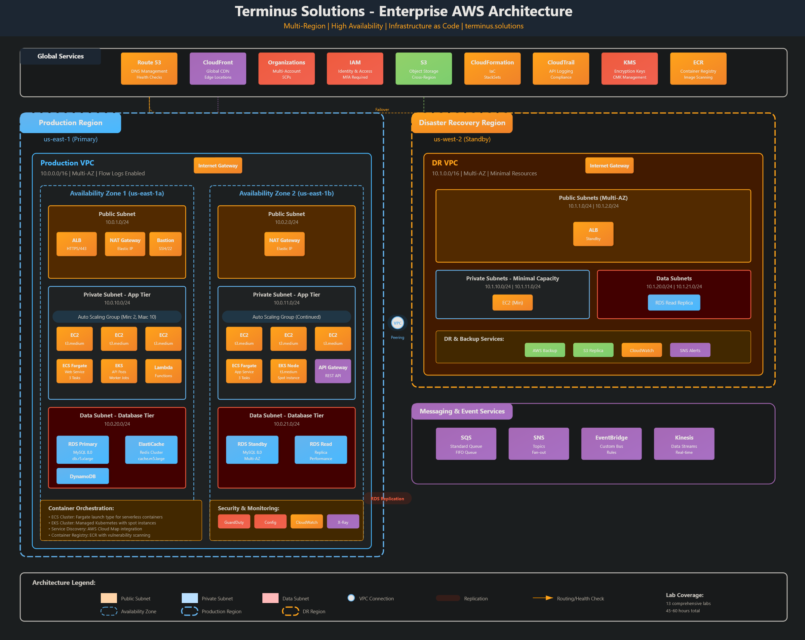

<!--
Terminus Solutions AWS Enterprise Architecture
Copyright (c) 2025 Jared (Terminus Solutions) - jaredintech.com
Licensed under CC BY-SA 4.0 - Attribution required
See LICENSE-DOCS for details
-->


<div align="center"> </div>

# **Terminus Solutions - Enterprise AWS Architecture**


  

> Building a production-ready, multi-account AWS infrastructure for a fictional technology consulting firm. This comprehensive project demonstrates enterprise cloud architecture best practices through 13 hands-on labs that I have developed after around 600 hours over the past 3 months, complete with detailed documentation, diagrams, screenshots, real-world cost analysis, IaC, and more.  I am also working on a YouTube channel to highlight this project as well as provide labs, tutorials, and all-encompassing personal and professional development strategies related to everything cloud.

## Table of Contents

- [Project Highlights](#project-highlights)
- [What I'm Building](#what-im-building)
- [Architecture Overview](#%EF%B8%8F-architecture-overview-before-ecs-and-eks-migration)
- [Project Navigation](#-project-navigation)
- [Cost Analysis](#-cost-analysis)
- [Documentation Structure](#-documentation-structure)
- [Technical Stack](#%EF%B8%8F-technical-stack)
- [Key Architectural Decisions](#-key-architectural-decisions)
- [Connect With Me](#-connect-with-me)
- [License](#license)
- [Acknowledgments](#-acknowledgments)

## Project Highlights

- **Enterprise-Scale Architecture**: Multi-account, multi-region infrastructure supporting 99.99% availability
- **Security First**: Zero-trust architecture with defense in depth across all layers
- **Cost Optimized**: 92% cost savings compared to traditional enterprise solutions
- **Fully Documented**: Architecture Decision Records (ADRs), cost analysis, and implementation guides
- **Real Implementation**: Working infrastructure with proof of concepts, not just theory

## What I'm Building

This repository contains the complete implementation of an enterprise AWS infrastructure for **Terminus Solutions**, a fictional technology consulting firm that needs:

### Core Infrastructure
- ✅ **Multi-Account Strategy**: AWS Organizations with Production, Development, and Security accounts
- ✅ **Global Networking**: Multi-region VPC architecture with VPC Peering
- ✅ **Compute Platform**: Auto-scaling EC2 fleets with mixed instance policies
- ✅ **Storage Strategy**: Multi-purpose S3 bucket architecture with cross-region replication for DR
- 📅 **Data Layer**: Aurora Serverless with cross-region replication
- 📅 **Content Delivery**: CloudFront with Route53 for global performance

### Modern Application Architecture
- 📅 **Containerization**: ECS Fargate for serverless containers and EKS cluster for Kubernetes workloads
- 📅 **Serverless**: Lambda functions with API Gateway
- 📅 **Event-Driven**: SQS, SNS, and EventBridge for decoupling
- 📅 **Observability**: CloudWatch, X-Ray, and Systems Manager

### Enterprise Security & Governance
- ✅ **Identity & Access**: Cross-account roles with MFA enforcement
- ✅ **Compliance**: CloudTrail organization trail with 7-year retention
- 📅 **Threat Detection**: GuardDuty, Security Hub, and Config
- 📅 **Infrastructure as Code**: CloudFormation and Terraform

> **Security Note:** All AWS account IDs, email addresses, and sensitive information in this repository are **redacted or fictional** for security compliance.

## 🏗️ Architecture Overview (Before ECS and EKS migration)




## 📊 Project Navigation

### 📊 Project Navigation

| Lab | Component | Status | Documentation |
|-----|-----------|--------|---------------|
| 1 | IAM & Organizations | ✅ Complete | [View](/labs/lab-01-iam/README.md) |
| 2 | VPC & Networking Core | ✅ Complete | [View](/labs/lab-02-vpc/README.md) |
| 3 | EC2 & Auto Scaling Platform | ✅ Complete | [View](/labs/lab-03-ec2/README.md) |
| 4 | S3 & Storage Strategy | ✅ Complete | [View](/labs/lab-04-s3/README.md) |
| 5 | RDS & Database Services | 📅 Planned | - |
| 6 | Route53 & CloudFront Distribution | 📅 Planned | - |
| 7 | ELB & High Availability | 📅 Planned | - |
| 8 | Lambda & API Gateway Services | 📅 Planned | - |
| 9 | SQS, SNS & EventBridge Messaging | 📅 Planned | - |
| 10 | CloudWatch & Systems Manager Monitoring | 📅 Planned | - |
| 11 | CloudFormation Infrastructure as Code | 📅 Planned | - |
| 12 | Security Services Integration | 📅 Planned | - |
| 13 | Container Services (ECS/EKS) | 📅 Planned | - |

*Last Updated: December 10, 2025*


## 💰 Cost Analysis

This project demonstrates enterprise-grade AWS architecture with intentional cost optimization strategies.

### Actual Infrastructure Costs

| Component | Development | Production | Optimization Applied |
|-----------|-------------|------------|---------------------|
| **ALB** | ~$18/mo | ~$25-40/mo | Right-sized LCU allocation |
| **EC2 (Auto Scaling Group)** | ~$15/mo (t3.micro) | ~$60-150/mo | Spot-ready ASG configuration |
| **RDS MySQL** | ~$15/mo (Single-AZ) | ~$30-60/mo (Multi-AZ) | GP3 storage, auto-scaling |
| **S3 + CloudFront** | ~$5-10/mo | ~$15-50/mo | Lifecycle policies, caching |
| **Route 53** | ~$1-2/mo | ~$2-5/mo | Alias records (free queries) |
| **NAT Gateway** | ~$32/mo | ~$32-65/mo | VPC endpoints reduce traffic |
| **CloudWatch** | ~$3-5/mo | ~$10-20/mo | Custom metrics, log retention |
| **Secrets Manager** | ~$1/mo | ~$2-5/mo | Consolidated secrets |
| **Total Estimate** | **~$90-100/mo** | **~$200-400/mo** | |

*Costs vary based on traffic, data transfer, and region. Estimates based on us-east-1 pricing as of 2025.*

See [detailed cost analysis](./architecture/cost-analysis/) for complete breakdowns and optimization strategies.


## 📚 Documentation Structure
```
terminus-solutions-aws-enterprise/
├── architecture/
│   ├── cost-analysis/     # Detailed cost projections and ROI
│   ├── decisions/         # Architecture Decision Records (ADRs)
│   └── diagrams/          # Visual architecture documentation
├── blog-posts/            # Deep-dive articles and lessons learned
├── documentation/
│   ├── compliance/        # Compliance and regulatory docs
│   ├── runbooks/          # Operational procedures
│   └── security/          # Security policies and procedures
├── infrastructure/
│   ├── cloudformation/    # AWS CloudFormation templates
│   ├── scripts/           # Automation and deployment scripts
│   └── terraform/         # Terraform modules and configs
├── labs/
│   └── lab-XX-name/       # Step-by-step implementation labs
│       ├── docs/          # Lab-specific documentation, troubleshooting, etc
│       ├── policies/      # IAM and SCP policies, if applicable
│       ├── screenshots/   # Implementation proof
│       └── README.md      # Lab walkthrough guide
└── videos/                # Demo videos and tutorials
```

## 🛠️ Technical Stack

### Core AWS Services
- **Compute**: EC2, Lambda
- **Storage**: S3, EBS, EFS
- **Database**: RDS, Aurora, DynamoDB
- **Network**: VPC, Peering DR, Route 53, CloudFront
- **Security**: IAM, GuardDuty, Security Hub, KMS
- **Containerization**: ECS, EKS for Kubernetes

### Infrastructure as Code
- **CloudFormation**: Native AWS IaC
- **Terraform**: Multi-cloud ready
- **AWS CDK**: For complex constructs

### Languages & Tools
- **Python**: Lambda functions, automation scripts
- **Bash**: Infrastructure automation
- **JSON/YAML**: Configuration and policies
- **draw.io/SVG**: Architecture diagrams

## 🎯 Key Architectural Decisions

- **[ADR-001](./architecture/decisions/adr-001-multi-account-strategy.md)**: Organization & Multi-Account Strategy
- **[ADR-002](./architecture/decisions/adr-002-vpc-cidr-allocation-strategy.md)**: IP Addressing Strategy
- **[ADR-003](./architecture/decisions/adr-003-network-segmentation-architecture.md)**: Networking Segmentation Strategy
- **...and more**

See all [Architecture Decision Records](./architecture/decisions/).


## 🤝 Connect With Me

I'm passionate about cloud architecture and always interested in discussing:
- Enterprise cloud strategies
- AI/ML integration
- Cost optimization techniques
- Security best practices
- Infrastructure automation

**Contact:**
- 📧 [Email](mailto:jared@jaredintech.com)
- 💼 [LinkedIn](https://linkedin.com/in/jaredintech)
- 🌐 [Website](https://jaredintech.com)
- 📝 [Blog Posts on LinkedIn](https://linkedin.com/in/jaredintech)

## License

This project uses multiple licenses:

- **Code** (Terraform, CloudFormation, Scripts): MIT License
- **Documentation** (Guides, ADRs, Tutorials): [CC BY-SA 4.0](https://creativecommons.org/licenses/by-sa/4.0/)
- **Architecture Diagrams & Designs**: [CC BY-SA 4.0](https://creativecommons.org/licenses/by-sa/4.0/)

This means:
- ✅ You can use the code freely
- ✅ You must attribute documentation/designs
- ✅ Improvements must be shared back
- ✅ Commercial use is allowed with attribution

For any inquiries regarding material in this repository, contact: jared@jaredintech.com  
Check out my website: www.jaredintech.com

## 🙏 Acknowledgments

- AWS Documentation and Best Practices Guides
- AWS Well-Architected Framework
- Cloud architecture community for inspiration

---

*This project is in an active upload state. Star ⭐ the repository to follow along with updates!*