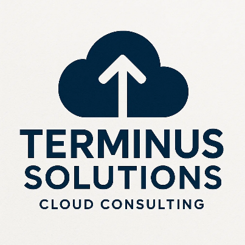

<!--
Terminus Solutions AWS Enterprise Architecture
Copyright (c) 2025 Jared (Terminus Solutions) - jaredintech.com
Licensed under CC BY-SA 4.0 - Attribution required
See LICENSE-DOCS for details
-->

#  Terminus Solutions - Architecture Documentation

This directory contains all architectural documentation for the Terminus Solutions AWS enterprise infrastructure project, including diagrams, cost analysis, and Architecture Decision Records (ADRs).

> **Security Note:** All AWS account IDs, email addresses, and sensitive information in this repository are **redacted or fictional** for security compliance.

## Table of Contents

- [Directory Structure](#-directory-structure)
- [Architecture Diagrams](#-architecture-diagrams)
- [Cost Analysis](#-cost-analysis)
- [Architecture Decision Records (ADRs)](#-architecture-decision-records-adrs)
- [Architectural Principles](#%EF%B8%8F-architectural-principles)
- [Architecture Evolution](#-architecture-evolution)
- [Quick Links](#-quick-links)
- [Success Metrics](#-success-metrics)
- [Contributing](#-contributing)
- [Review Schedule](#-review-schedule)
- [Project Navigation](#-project-navigation)

## 📁 Directory Structure
```
architecture/
├── cost-analysis/      # Detailed cost projections and optimization strategies
├── decisions/          # Architecture Decision Records (ADRs)
└── diagrams/           # Visual architecture documentation
```

## 🎨 Architecture Diagrams

### Overview Diagrams
- **[Architecture Overview](./diagrams/architecture-overview.png)** - Complete multi-region enterprise architecture showing all 13 labs integrated
- **[IAM Architecture](./diagrams/iam-architecture.png)** - Multi-account organizational structure with IAM roles and policies
- **[VPC Architecture](./diagrams/vpc-architecture.png)** - Network architecture with multi-region VPC design
- **[Compute Architecture](./diagrams/ec2-architecture.png)** - EC2 Auto Scaling platform with multi-tier deployment
- **[Storage Architecture](./diagrams/s3-architecture.png)** - S3 multi-bucket strategy with lifecycle management
- **[Database Architecture](./diagrams/rds-architecture.png)** - RDS Multi-AZ with read replicas and DR
- **[CDN Architecture](./diagrams/cloudfront-route53-architecture.png)** - Route 53 + CloudFront global content delivery

### Diagram Standards
- **Color Coding**: Consistent service colors matching AWS documentation
- **Layout**: Logical and clearly define boundaries showing isolation and connection when necessary
- **Detail Level**: Balance between clarity and completeness
- **Tools Used**: draw.io for consistency and editability

## 📊 Cost Analysis

My cost analysis provides detailed projections for organizations of different sizes:  

**[Index](./cost-analysis/README.md)**

### Cost Categories Covered
- **Small Organization**: 3-5 accounts, ~$165/month
- **Medium Organization**: 10-20 accounts, ~$543/month  
- **Enterprise Organization**: 50+ accounts, ~$1,865/month

### Current Implementation Costs (Labs 1-6)
- **Labs 1-2 (Foundation)**: ~$253/month (IAM, Organizations, VPC, NAT Gateways)
- **Lab 3 (Compute)**: ~$81/month (2x t3.small + ALB + EBS)
- **Lab 4 (Storage)**: ~$11/month (S3 with lifecycle optimization)
- **Lab 5 (Database)**: ~$65/month (RDS Multi-AZ + Secrets Manager)
- **Lab 6 (DNS & CDN)**: ~$15/month (Route 53 + CloudFront + basic WAF)
- **Total**: ~$425/month (~$5,108/year)

### Key Insights
- 90-95% cost savings vs traditional enterprise tools
- Detailed optimization strategies for each service
- ROI calculations and business justification
- Price class and cache optimization for CDN
- GP3 storage and Multi-AZ only when needed for databases

## 📋 Architecture Decision Records (ADRs)

ADRs document key architectural decisions with context, alternatives considered, and rationale.

### Foundation (Labs 1-2)
| ADR | Title | Status | Lab |
|-----|-------|--------|-----|
| [001](./decisions/adr-001-multi-account-strategy.md) | Multi-Account Strategy with AWS Organizations | Accepted | Lab 1 |
| [002](./decisions/adr-002-vpc-cidr-allocation-strategy.md) | VPC CIDR Allocation Strategy | Accepted | Lab 2 |
| [003](./decisions/adr-003-network-segmentation-architecture.md) | Network Segmentation Architecture | Accepted | Lab 2 |
| [004](./decisions/adr-004-multi-region-dr-network-design.md) | Multi-Region DR Network Design | Accepted | Lab 2 |
| [005](./decisions/adr-005-network-security-controls-strategy.md) | Network Security Controls Strategy | Accepted | Lab 2 |
| [006](./decisions/adr-006-vpc-endpoints-private-connectivity.md) | VPC Endpoints and Private Connectivity | Accepted | Lab 2 |

### Compute & Storage (Labs 3-4)
| ADR | Title | Status | Lab |
|-----|-------|--------|-----|
| [007](./decisions/adr-007-compute-platform-architecture.md) | Compute Platform Architecture | Accepted | Lab 3 |
| [008](./decisions/adr-008-auto-scaling-strategy.md) | Auto Scaling Strategy | Accepted | Lab 3 |
| [009](./decisions/adr-009-instance-profile-security.md) | Instance Profile Security | Accepted | Lab 3 |
| [010](./decisions/adr-010-ami-lifecycle-management.md) | AMI Lifecycle Management | Accepted | Lab 3 |
| [011](./decisions/adr-011-storage-performance-optimization.md) | Storage Performance Optimization | Accepted | Lab 3 |
| [012](./decisions/adr-012-object-storage-strategy.md) | Object Storage Strategy | Accepted | Lab 4 |
| [013](./decisions/adr-013-data-lifecycle-management.md) | Data Lifecycle Management | Accepted | Lab 4 |
| [014](./decisions/adr-014-cross-region-replication-strategy.md) | Cross-Region Replication Strategy | Accepted | Lab 4 |
| [015](./decisions/adr-015-cdn-integration-architecture.md) | CDN Integration Architecture | Accepted | Lab 4 |
| [016](./decisions/adr-016-event-driven-storage-processing.md) | Event-Driven Storage Processing | Accepted | Lab 4 |

### Database & Content Delivery (Labs 5-6)
| ADR | Title | Status | Lab |
|-----|-------|--------|-----|
| [017](./decisions/adr-017-database-platform-selection.md) | Database Platform Selection | Accepted | Lab 5 |
| [018](./decisions/adr-018-database-high-availability.md) | Database High Availability Strategy | Accepted | Lab 5 |
| [019](./decisions/adr-019-database-security-encryption.md) | Database Security and Encryption | Accepted | Lab 5 |
| [020](./decisions/adr-020-dns-routing-strategy.md) | DNS and Global Routing Strategy | Accepted | Lab 6 |
| [021](./decisions/adr-021-cdn-architecture.md) | CDN Architecture and Caching Strategy | Accepted | Lab 6 |
| [022](./decisions/adr-022-waf-security-strategy.md) | WAF and Edge Security Strategy | Accepted | Lab 6 |

See [ADR Index](./decisions/README.md) for templates and process documentation.

## 🏛️ Architectural Principles

### 1. **Security First**
- Defense in depth across all layers
- Zero trust networking model
- Encryption at rest and in transit (KMS, ACM, RDS encryption)
- Least privilege access everywhere
- Instance profiles over stored credentials
- WAF protection at the edge

### 2. **High Availability**
- Multi-AZ deployments in production
- Multi-region DR capability
- Automated failover mechanisms (RDS Multi-AZ, Route 53 health checks)
- Auto Scaling for resilience
- 99.99% availability target
- CloudFront edge locations for global availability

### 3. **Cost Optimization**
- Right-sizing based on actual usage
- Automated resource cleanup
- Lifecycle policies for data (up to 95% savings)
- Reserved capacity where appropriate
- gp3 volumes for performance/cost balance
- CloudFront price class optimization
- Cache hit ratio optimization (target: >80%)

### 4. **Operational Excellence**
- Infrastructure as Code for everything
- Automated monitoring and alerting
- Self-healing infrastructure
- Comprehensive documentation
- Systems Manager for SSH-free administration
- Secrets Manager for credential rotation

### 5. **Scalability**
- Auto-scaling for all applicable services
- Target tracking policies for predictable scaling
- Event-driven architecture
- Global content delivery via CloudFront
- Read replicas for database read scaling
- Origin Shield for origin protection

## 🔄 Architecture Evolution

### Phase 1: Foundation (Labs 1-2) ✅
- Multi-account structure ✅
- Network backbone ✅
- Security baseline ✅
- VPC endpoints configured ✅

### Phase 2: Compute & Data (Labs 3-6) ✅
- Scalable compute platform ✅
- Multi-tier storage architecture ✅
- Database services with Multi-AZ HA ✅
- DNS and global routing ✅
- Content delivery network ✅
- WAF edge protection ✅

### Phase 3: Application Services (Labs 7-10)
- Load balancing & HA 📅
- Serverless components 📅
- Message-driven architecture 📅
- Comprehensive monitoring 📅

### Phase 4: Operations & Modernization (Labs 11-13)
- Infrastructure as Code 📅
- Advanced security services 📅
- Container orchestration 📅

## 🔗 Quick Links

### Implementation
- [Lab 1: IAM & Organizations](../labs/lab-01-iam/) - Foundation implementation
- [Lab 2: VPC & Networking](../labs/lab-02-vpc/) - Network implementation
- [Lab 3: EC2 & Auto Scaling](../labs/lab-03-ec2/) - Compute implementation
- [Lab 4: S3 & Storage](../labs/lab-04-s3/) - Storage implementation
- [Lab 5: RDS & Database](../labs/lab-05-rds/) - Database implementation
- [Lab 6: Route53 & CloudFront](../labs/lab-06-route53-cloudfront/) - DNS & CDN implementation
- [All Labs](../labs/) - Complete implementation guide

### Documentation
- [Project Readme](../README.md) - Project overview
- [Blog Posts](../blog-posts/) - LinkedIn Posts
- [Documentation](../documentation/) - Additional technical docs

### Key Resources
- [Cost Analysis](./cost-analysis/) - Detailed pricing and optimization
- [Troubleshooting Guides](../labs/) - Per-lab troubleshooting docs
- [Testing Checklists](../labs/) - Validation procedures

## 📈 Success Metrics

| Metric | Target | Current Status |
|--------|--------|----------------|
| Availability | 99.99% | Labs 1-6 validated |
| RTO | < 15 minutes | Cross-region DR ready |
| RPO | < 5 minutes | S3 + RDS replication configured |
| Cost vs Traditional | -90% | Achieved (90-95% savings) |
| Security Score | A+ | WAF + encryption implemented |
| Scaling Response | < 5 minutes | Target tracking + health checks active |
| Cache Hit Ratio | > 80% | CloudFront optimized |
| Database Failover | < 60 seconds | Multi-AZ automatic failover |

## 🤝 Contributing

When adding architectural documentation:
1. **Diagrams**: Use draw.io and export as PNG with source
2. **ADRs**: Follow the template and link to implementations
3. **Cost Analysis**: Include real AWS pricing with date
4. **Updates**: Keep README sections current

## 📅 Review Schedule

- **Weekly**: Update implementation status
- **Monthly**: Review and update cost projections
- **Quarterly**: Reassess architectural decisions
- **Annually**: Major architecture review

---

### 📊 Project Navigation

| Lab | Component | Status | Documentation |
|-----|-----------|--------|---------------|
| 1 | IAM & Organizations | ✅ Complete | [View](/labs/lab-01-iam/README.md) |
| 2 | VPC & Networking Core | ✅ Complete | [View](/labs/lab-02-vpc/README.md) |
| 3 | EC2 & Auto Scaling Platform | ✅ Complete | [View](/labs/lab-03-ec2/README.md) |
| 4 | S3 & Storage Strategy | ✅ Complete | [View](/labs/lab-04-s3/README.md) |
| 5 | RDS & Database Services | ✅ Complete | [View](/labs/lab-05-rds/README.md) |
| 6 | Route53 & CloudFront Distribution | ✅ Complete | [View](/labs/lab-06-route53-cloudfront/README.md) |
| 7 | ELB & High Availability | 📅 Planned | - |
| 8 | Lambda & API Gateway Services | 📅 Planned | - |
| 9 | SQS, SNS & EventBridge Messaging | 📅 Planned | - |
| 10 | CloudWatch & Systems Manager Monitoring | 📅 Planned | - |
| 11 | CloudFormation Infrastructure as Code | 📅 Planned | - |
| 12 | Security Services Integration | 📅 Planned | - |
| 13 | Container Services (ECS/EKS) | 📅 Planned | - |

*Last Updated: December 22, 2025*