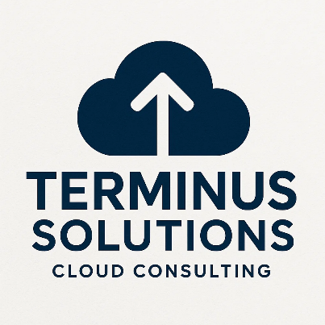

<!--
Terminus Solutions AWS Enterprise Architecture
Copyright (c) 2025 Jared (Terminus Solutions) - jaredintech.com
Licensed under CC BY-SA 4.0 - Attribution required
See LICENSE-DOCS for details
-->

#  Terminus Solutions - Implementation Labs

This directory contains all hands-on implementation labs for the Terminus Solutions AWS enterprise infrastructure project. Each lab builds upon previous ones to create a complete, production-ready cloud environment.

> **Security Note:** All AWS account IDs, email addresses, and sensitive information in this repository are **redacted or fictional** for security compliance.

## Table of Contents

- [Overview](#overview)
- [Lab Structure](#-lab-structure)
- [Prerequisites](#-prerequisites)
- [Lab Directory Layout](#-lab-directory-layout)
- [Implementation Path](#%EF%B8%8F-implementation-path)
- [Time Investment](#%EF%B8%8F-time-investment)
- [Cost Summary](#-cost-summary)
- [How to Use These Labs](#-how-to-use-these-labs)
- [Lab Index](#-lab-index)
- [Project Navigation](#-project-navigation)

## Overview

These 13 labs describe an example of building an enterprise-grade AWS architecture from the ground up. Starting with foundational identity and access management, they progressively add networking, compute, storage, databases, and advanced services ending with a fully operational multi-region architecture.  Depending on feedback/demand, I will expand this project accordingly, including adding in step-by-step instructions for each lab, and video walkthroughs.

### What I'm building
- Multi-account AWS Organizations structure
- Multi-region VPC networking with DR capability
- Auto-scaling compute platform
- Secure storage and database tiers
- Global content delivery
- Serverless and container workloads
- Comprehensive monitoring and security

## 📁 Lab Structure

Each lab follows a consistent structure for easy navigation:
```
labs/
├── lab-01-iam/
│   ├── README.md           # Main lab walkthrough
│   ├── docs/               # Supporting documentation
│   │   ├── lab-01-costs.md
│   │   └── lab-01-troubleshooting.md
│   ├── policies/           # IAM policies, SCPs, role configs
│   │   ├── iam/
│   │   └── scps/
│   ├── screenshots/        # Implementation proof
│   └── videos/             # Demo recordings
├── lab-02-vpc/
│   ├── README.md
│   ├── docs/
│   │   ├── lab-02-costs.md
│   │   ├── lab-02-troubleshooting.md
│   │   └── network-testing-checklist.md
│   ├── screenshots/
│   └── videos/
└── [lab-03 through lab-13...]
```

## ✅ Prerequisites

### For All Labs
- AWS Account with administrative access
- AWS CLI v2 installed and configured
- Basic understanding of cloud concepts
- Text editor or IDE

### Recommended Knowledge
- Familiarity with JSON/YAML
- Basic networking concepts (IP addressing, subnets)
- Command line proficiency

### Tools Used
- AWS Management Console
- AWS CLI
- draw.io (for diagrams)
- Git (for version control)

## 📂 Lab Directory Layout

| Directory | Purpose |
|-----------|---------|
| `README.md` | Main lab guide with step-by-step instructions |
| `docs/` | Cost analysis, troubleshooting guides, checklists |
| `policies/` | IAM policies, SCPs, and configuration files |
| `screenshots/` | Visual proof of implementation |
| `videos/` | Demo recordings and walkthroughs |

## 🛤️ Implementation Path

The labs are designed to be completed in sequence:
```
Phase 1: Foundation (Labs 1-2)
├── Lab 1: Identity & Access Management
└── Lab 2: Network Infrastructure
    
Phase 2: Compute & Data (Labs 3-6)
├── Lab 3: Compute Platform
├── Lab 4: Storage Services
├── Lab 5: Database Services
└── Lab 6: DNS & CDN

Phase 3: Application Services (Labs 7-10)
├── Lab 7: Load Balancing
├── Lab 8: Serverless
├── Lab 9: Messaging
└── Lab 10: Monitoring

Phase 4: Operations & Modernization (Labs 11-13)
├── Lab 11: Infrastructure as Code
├── Lab 12: Security Services
└── Lab 13: Containers
```

## ⏱️ Time Investment

| Lab | Estimated Time | Difficulty |
|-----|----------------|------------|
| Lab 1: IAM & Organizations | 3-8 hours | ⭐⭐ Intermediate |
| Lab 2: VPC & Networking | 4-10 hours | ⭐⭐⭐ Advanced |
| Lab 3: EC2 & Auto Scaling | 4-10 hours | ⭐⭐ Intermediate |
| Lab 4: S3 & Storage | 2-6 hours | ⭐ Beginner |
| Lab 5: RDS & Databases | 3-8 hours | ⭐⭐ Intermediate |
| Lab 6: Route53 & CloudFront | 3-8 hours | ⭐⭐ Intermediate |
| Lab 7: ELB & HA | 2-6 hours | ⭐⭐ Intermediate |
| Lab 8: Lambda & API Gateway | 3-8 hours | ⭐⭐ Intermediate |
| Lab 9: SQS, SNS & EventBridge | 2-6 hours | ⭐⭐ Intermediate |
| Lab 10: CloudWatch & SSM | 3-8 hours | ⭐⭐ Intermediate |
| Lab 11: CloudFormation | 4-10 hours | ⭐⭐⭐ Advanced |
| Lab 12: Security Services | 3-8 hours | ⭐⭐⭐ Advanced |
| Lab 13: Container Services | 5-12 hours | ⭐⭐⭐ Advanced |

**Total Estimated Time:** 40-110 hours (this can vary widely depending on a variety of factors)

## 💰 Cost Summary

| Phase | Labs | Monthly Cost | Notes |
|-------|------|--------------|-------|
| Foundation | 1-2 | ~$50 | Primarily NAT Gateway costs |
| Compute & Data | 3-6 | ~$150 | EC2, RDS, S3, CloudFront |
| Application | 7-10 | ~$75 | Load balancers, Lambda, monitoring |
| Operations | 11-13 | ~$100 | Security services, containers |
| **Total** | **All** | **~$375** | Production-like environment |

> **Tip:** Most resources can be stopped or deleted after each lab to minimize costs. See individual lab cost documents for optimization strategies.

## 📖 How to Use These Labs

### Getting Started
1. **Read the Overview**: Start with each lab's README.md to understand objectives
2. **Check Prerequisites**: Ensure you've completed prior labs
3. **Review Costs**: Check the cost analysis before provisioning resources
4. **Follow Step-by-Step**: Execute instructions in order
5. **Validate**: Use the testing sections to verify your work
6. **Troubleshoot**: Reference troubleshooting guides for common issues

### Best Practices
- Take screenshots as you go for your own documentation
- Read the Architecture Decision Records (ADRs) to understand the "why"
- Don't skip the testing and validation sections
- Clean up resources when not in use to control costs
- Use the troubleshooting guides before searching elsewhere

### If You Get Stuck
1. Check the troubleshooting guide in the lab's `docs/` folder
2. Review the AWS documentation linked in each lab
3. Verify prerequisites from previous labs are complete
4. Check security group and IAM permissions

## 📋 Lab Index

### Lab 1: IAM & Organizations Foundation
**Status:** ✅ Complete

Establish the security backbone with multi-account AWS Organizations, Service Control Policies, cross-account IAM roles, and comprehensive CloudTrail auditing.

**Key Outcomes:**
- 4-account organizational structure
- Production and Development SCPs
- Cross-account access patterns
- Organization-wide audit logging

[View Lab 1 →](./lab-01-iam/README.md)

---

### Lab 2: VPC & Networking Core
**Status:** ✅ Complete

Build a production-grade, multi-region network infrastructure with three-tier VPC architecture, redundant NAT Gateways, VPC peering, and comprehensive security controls.

**Key Outcomes:**
- Multi-region VPC design (us-east-1 + us-west-2)
- Three-tier subnet architecture
- Cross-region VPC peering for DR
- Security groups and NACLs
- VPC endpoints for private AWS access

[View Lab 2 →](./lab-02-vpc/README.md)

---

### Lab 3: EC2 & Auto Scaling Platform
**Status:** 🚧 In Progress

Deploy a scalable compute platform with Auto Scaling groups, launch templates, and mixed instance policies.

---

### Lab 4: S3 & Storage Strategy
**Status:** 📅 Planned

Implement a comprehensive storage strategy with S3 buckets, lifecycle policies, cross-region replication, and encryption.

---

### Lab 5: RDS & Database Services
**Status:** 📅 Planned

Configure managed database services with RDS Multi-AZ deployments, read replicas, and automated backups.

---

### Lab 6: Route53 & CloudFront Distribution
**Status:** 📅 Planned

Set up global DNS and content delivery with Route53 hosted zones, health checks, and CloudFront distributions.

---

### Lab 7: ELB & High Availability
**Status:** 📅 Planned

Implement load balancing with Application Load Balancers, target groups, and health checks.

---

### Lab 8: Lambda & API Gateway Services
**Status:** 📅 Planned

Build serverless applications with Lambda functions, API Gateway, and event-driven architectures.

---

### Lab 9: SQS, SNS & EventBridge Messaging
**Status:** 📅 Planned

Create decoupled architectures with message queues, notifications, and event buses.

---

### Lab 10: CloudWatch & Systems Manager Monitoring
**Status:** 📅 Planned

Establish comprehensive observability with CloudWatch dashboards, alarms, and Systems Manager automation.

---

### Lab 11: CloudFormation Infrastructure as Code
**Status:** 📅 Planned

Convert manual configurations to Infrastructure as Code with CloudFormation templates and nested stacks.

---

### Lab 12: Security Services Integration
**Status:** 📅 Planned

Enhance security posture with GuardDuty, Security Hub, Config, and WAF.

---

### Lab 13: Container Services (ECS/EKS)
**Status:** 📅 Planned

Deploy containerized workloads with ECS Fargate and EKS for Kubernetes orchestration.

---

### 📊 Project Navigation

| Lab | Component | Status | Documentation |
|-----|-----------|--------|---------------|
| 1 | IAM & Organizations | ✅ Complete | [View](/labs/lab-01-iam/README.md) |
| 2 | VPC & Networking Core | ✅ Complete | [View](/labs/lab-02-vpc/README.md) |
| 3 | EC2 & Auto Scaling Platform | 🚧 In Progress | - |
| 4 | S3 & Storage Strategy | 📅 Planned | - |
| 5 | RDS & Database Services | 📅 Planned | - |
| 6 | Route53 & CloudFront Distribution | 📅 Planned | - |
| 7 | ELB & High Availability | 📅 Planned | - |
| 8 | Lambda & API Gateway Services | 📅 Planned | - |
| 9 | SQS, SNS & EventBridge Messaging | 📅 Planned | - |
| 10 | CloudWatch & Systems Manager Monitoring | 📅 Planned | - |
| 11 | CloudFormation Infrastructure as Code | 📅 Planned | - |
| 12 | Security Services Integration | 📅 Planned | - |
| 13 | Container Services (ECS/EKS) | 📅 Planned | - |

*Last Updated: December 3rd, 2025*