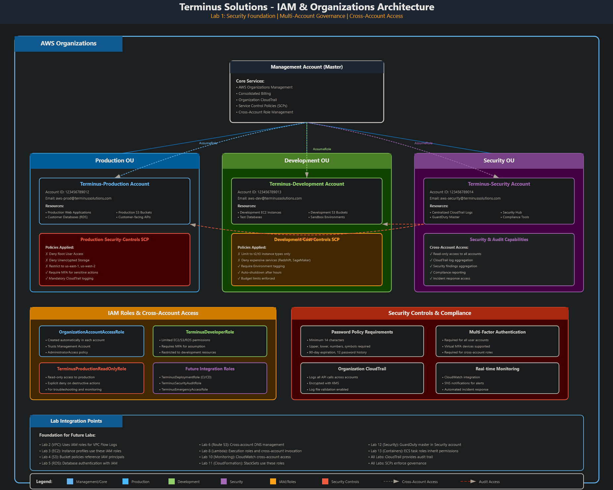
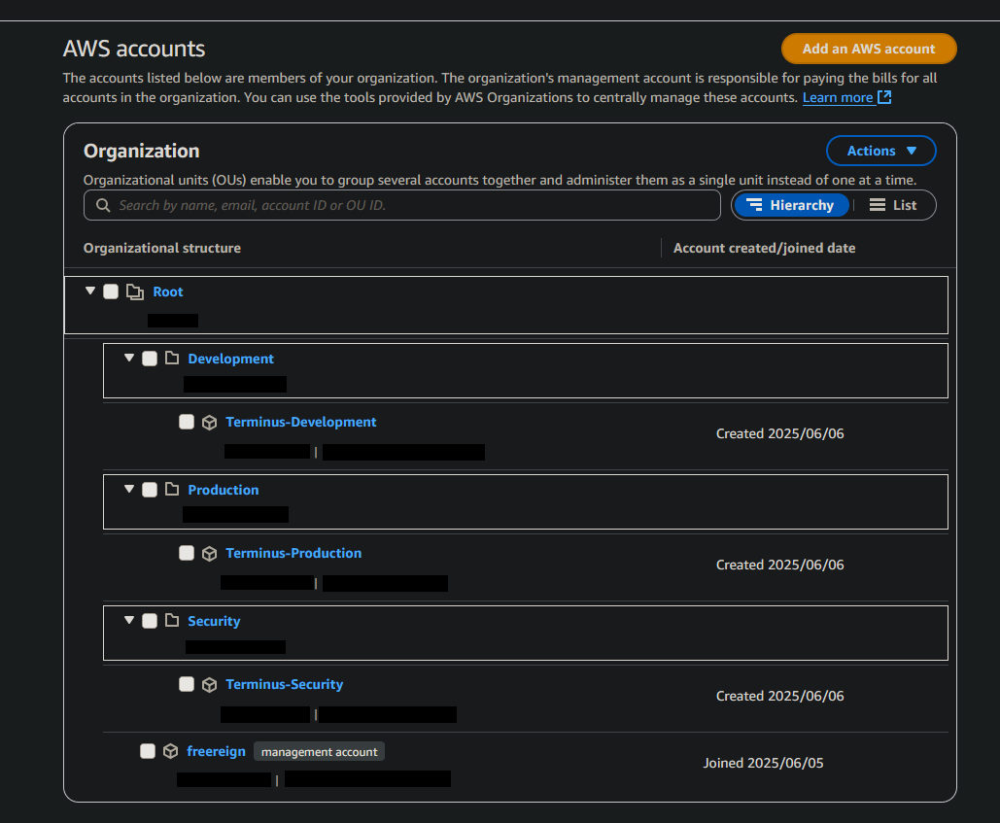
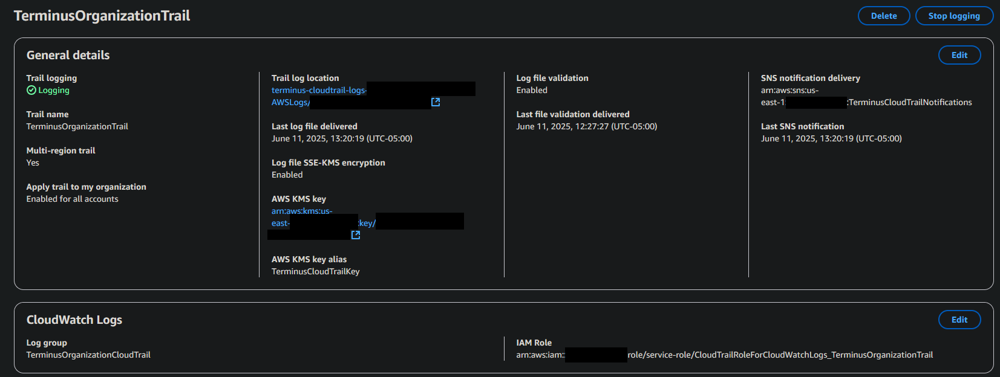

<!--
Terminus Solutions AWS Enterprise Architecture
Copyright (c) 2024 Jared (Terminus Solutions) - jaredintech.com
Licensed under CC BY-SA 4.0 - Attribution required
See LICENSE-DOCS for details
-->

#  Lab 1 - IAM & Organizations Foundation

## What I Built

In this lab, I established the security backbone for Terminus Solutions' cloud infrastructure. I created a multi-account AWS Organizations structure with three accounts (Production, Development, Security), implemented Service Control Policies for governance, set up cross-account access patterns, and configured comprehensive audit logging with CloudTrail.

> **Architecture Decision**: See [ADR-001: Multi-Account Strategy](../../architecture/decisions/adr-001-multi-account-strategy.md) for detailed rationale.

> **Security Note:** All AWS account IDs, email addresses, and sensitive information in this repository are **redacted or fictional** for security compliance.

## 🏗️ Architecture



The architecture implements a hierarchical governance model with AWS Organizations at the root, three Organizational Units (Production, Development, Security) with their respective accounts, and Service Control Policies that enforce security guardrails across the entire organization.

## ✅ Prerequisites

- ✅ AWS Free Tier account (becomes Management account)
- ✅ Multiple email addresses for member accounts

## 💰 Cost Considerations

**USD**: $0.00 for the puporses of this lab.

- Refer to [Cost Considerations](./docs/lab-01-costs.md) for comprehensive cost analysis pertaining to the lab series.
- Refer to [Baseline Costs](../../architecture/cost-analysis/baseline-costs.md) for in-depth architectural cost analysis pertaining to organizations at greater scale.

## 🔐 Policies and Roles Created

### Service Control Policies (SCPs)
- **[Production-Security-Controls](./policies/scps/production-security-controls.json)** - Enforces encryption, denies root access, restricts to approved regions
- **[Development-Cost-Controls](./policies/scps/development-cost-controls.json)** - Limits instance types, requires tagging, blocks expensive services

### IAM Policies
- **[TerminusDeveloperPolicy](./policies/iam/dev-role-policy.json)** - Controlled development access with instance type conditions
- **[TerminusProductionReadOnlyPolicy](./policies/iam/prod-readonly-role-policy.json)** - Audit access with explicit deny on destructive actions

### IAM Roles (Cross-Account)
- **OrganizationAccountAccessRole** - Default administrative access from management account
- **TerminusDeveloperRole** - Limited development environment access with MFA required
- **TerminusProductionReadOnlyRole** - Production visibility for troubleshooting and audits

### Password and MFA Policies
- **Password Policy** - 14 characters, complexity requirements, 90-day rotation
- **MFA Enforcement** - Required for all cross-account role assumptions

## 📝 Implementation Notes

### Key Steps

**Time Investment**: 3 hours implementation + 2 hours debugging + 3 hours documentation

1. **Created AWS Organization with All Features**
   ```bash
   # Enabled in console - provides SCPs and advanced governance
   # Not just consolidated billing
   ```

2. **Set Up Three Member Accounts**
   ```
   - Terminus-Production (aws-prod@domain.com)
   - Terminus-Development (aws-dev@domain.com)  
   - Terminus-Security (aws-security@domain.com)
   ```

3. **Implemented Service Control Policies**
   ```json
   # Production SCP - Denies root access, enforces encryption
   # Development SCP - Limits instance types, enforces tagging
   ```

4. **Implemented Cross-Account IAM Role Policies

### Important Configurations

```yaml
# Key configuration values used
Organization: All Features enabled
Accounts: 4 total (1 management + 3 member)
OUs: Production, Development, Security
SCPs: Production-Security-Controls, Development-Cost-Controls
Roles: OrganizationAccountAccessRole, TerminusDeveloperRole, TerminusProductionReadOnlyRole
CloudTrail: Organization-wide trail with KMS encryption
MFA: Required for all cross-account access
```

## 🚧 Challenges & Solutions

### Challenge 1: Account Creation Taking Forever
**Solution**: Account creation takes 5-10 minutes. Created all three accounts in parallel and worked on OU structure while waiting.

### Challenge 2: SCP Not Applying Immediately
**Solution**: SCPs can take 5-10 minutes to propagate. Tested in member accounts (not management account which is exempt).

### Challenge 3: Central Tracking of Cross-Account Roles & Accounts
**Solution**: Created role naming conventions (Terminus[Environment][Purpose]Role). Documented cross-account access patterns in access matrix. Used descriptive role session names for CloudTrail attribution. Established process for role assumption testing via CLI and console. Created access matrix to track permissions (in lieu of SailPoint/CyberArk).

### Challenge 4: IAM & SCP Policy Creation, Implementation, & Testing
**Solution**: Started with permissive IAM policies, used SCPs for restrictions. Tested each layer systematically (account isolation → SCP → IAM → resource). Used CloudTrail to debug permission denials ("explicit deny in service control policy"). Created test matrix to verify expected allow/deny behavior. Applied principle of least privilege with conditions for resource and instance type restrictions.  Spent time debugging IAM policies.

## ✨ Proof It Works

### 🧪 Test Results (Sensitive Data Removed for Security Purposes)
```bash
# Tested cross-account access
$ aws sts assume-role \
   --role-arn "arn:aws:iam::REDACTED:role/OrganizationAccountAccessRole" \
   --role-session-name "CloudShellTestSession"
{
    "Credentials": {
        "AccessKeyId": "REDACTED",
        "SecretAccessKey": "REDACTED",
        "SessionToken": "REDACTED",
        "Expiration": "2025-06-11T07:18:29+00:00"
    
    "AssumedRoleUser": {
        "AssumedRoleId": "REDACTED:CloudShellTestSession",
        "Arn": "arn:aws:sts::REDACTED:assumed-role/OrganizationAccountAccessRole/CloudShellTestSession"
    
}
```

### 📸 Screenshots

*All accounts organized into proper OUs with SCPs applied*


*Organization-wide CloudTrail capturing all API activity*

## 🔧 Testing & Troubleshooting

|Role|EC2 Launch|EC2 View|S3 Create|S3 Delete|RDS Create|
|---|---|---|---|---|---|
|TerminusDeveloperRole|✓ (t2/t3 only)|✓|✓ (dev buckets)|✓ (dev buckets)|✓ (t2/t3 only)|
|TerminusProductionReadOnlyRole|✗|✓|✗|✗|✗|

**For detailed solutions and additional issues, see the complete [Troubleshooting Guide](./docs/lab-01-troubleshooting.md).**

## 🚀 Next Steps

- [x] Lab 2: VPC & Networking Core
- [ ] Optional: Add AWS Identity Center for federated access instead of IAM users

---

### 📊 Project Navigation

| Lab | Component | Status | Documentation |
|-----|-----------|--------|---------------|
| 1 | IAM & Organizations | ✅ Complete | [View](/labs/lab-01-iam/README.md) |
| 2 | VPC & Networking Core | 🚧 In Progress | [View](/labs/lab-02-vpc/README.md) |
| 3 | EC2 & Auto Scaling Platform | 📅 Planned | - |
| 4 | S3 & Storage Strategy | 📅 Planned | - |
| 5 | RDS & Database Services | 📅 Planned | - |
| 6 | Route53 & CloudFront Distribution | 📅 Planned | - |
| 7 | ELB & High Availability | 📅 Planned | - |
| 8 | Lambda & API Gateway Services | 📅 Planned | - |
| 9 | SQS, SNS & EventBridge Messaging | 📅 Planned | - |
| 10 | CloudWatch & Systems Manager Monitoring | 📅 Planned | - |
| 11 | CloudFormation Infrastructure as Code | 📅 Planned | - |
| 12 | Security Services Integration | 📅 Planned | - |
| 13 | Container Services (ECS/EKS) | 📅 Planned | - |

---

*Lab Status: ✅ Complete*  
*Last Updated: June 11th, 2025*