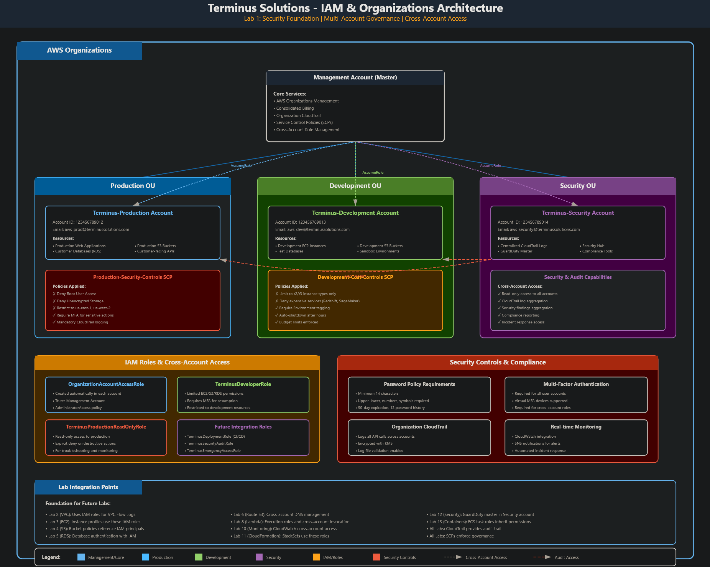
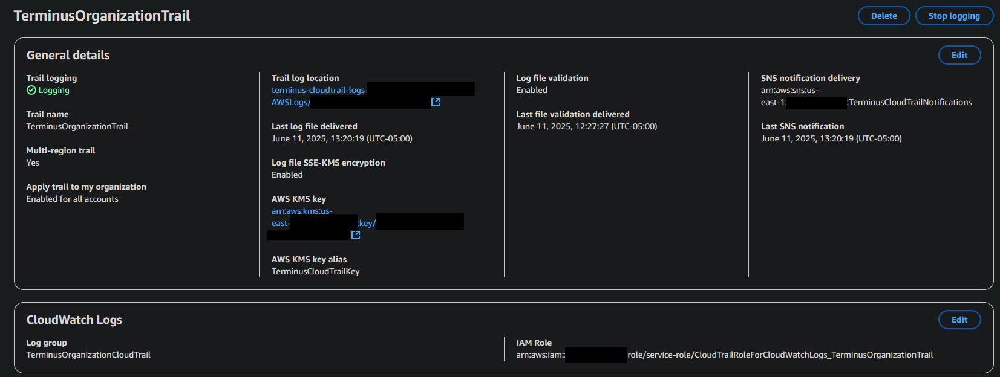

<!--
Terminus Solutions AWS Enterprise Architecture
Copyright (c) 2025 Jared (Terminus Solutions) - jaredintech.com
Licensed under CC BY-SA 4.0 - Attribution required
See LICENSE-DOCS for details
-->

#  Lab 1 - IAM & Organizations Foundation

## 📑 Table of Contents

- [Overview](#overview)
- [Architecture Decisions](#-architecture-decisions)
- [Architecture Diagram](#%EF%B8%8F-architecture-diagram)
- [Prerequisites](#-prerequisites)
- [Cost Considerations](#-cost-considerations)
- [Components Created](#-policies-and-roles-created)
- [Implementation Notes](#-implementation-notes)
- [Challenges & Solutions](#-challenges--solutions)
- [Proof It Works](#-proof-it-works)
- [Testing & Validation](#-testing--validation)
- [Next Steps](#-next-steps)
- [Project Navigation](#-project-navigation)

## What I Built

In this lab, I established the security backbone for Terminus Solutions' cloud infrastructure. I created a multi-account AWS Organizations structure with three accounts (Production, Development, Security), implemented Service Control Policies for governance, set up cross-account access patterns, and configured comprehensive audit logging with CloudTrail.

> **Security Note:** All AWS account IDs, email addresses, and sensitive information in this repository are **redacted or fictional** for security compliance.

## Overview

### Why This Lab Matters

Every enterprise AWS deployment begins with a single question: *How do we organize our cloud environment to scale securely?*

Get this wrong, and you're rebuilding from scratch in 18 months. Get it right, and every subsequent decision becomes easier.

This lab establishes the security and governance backbone for Terminus Solutions. It's not the most exciting work, there are no applications deployed, no websites launched, but it's the foundation that makes everything else possible.

### The Enterprise Thinking

**Why multi-account instead of one account with IAM boundaries?**

A single AWS account is a single blast radius. One misconfigured IAM policy, one compromised credential, and your production database lives next to your development sandbox. Enterprises learned this lesson painfully throughout the 2010s.

AWS Organizations lets us create hard boundaries. Production and Development don't share IAM, don't share service limits, don't share billing noise. A developer experimenting in dev literally *cannot* accidentally terminate production instances, the credentials don't work there.

**Why Service Control Policies matter more than IAM policies**

IAM policies grant permissions. SCPs restrict what's *possible*, even for administrators. 

Our Production SCP denies root user access entirely. It doesn't matter if someone has the root credentials; the organization-level control blocks execution. This is defense in depth: IAM is the first gate, SCPs are the wall behind it.

Our Development SCP restricts instance types to t2/t3 families. Developers can't accidentally spin up a p4d.24xlarge at $32/hour, the API call will fail regardless of their IAM permissions.

**Why centralized audit logging from Day 1**

CloudTrail isn't optional for enterprises, it's the answer to "who did what and when" that auditors, security teams, and incident responders need. 

By configuring an organization-wide trail in the management account, every API call across every member account flows to a single, immutable log. When (not if) something goes wrong, the forensic trail exists.

### What This Lab Creates

```
Terminus Solutions Organization
├── Management Account (billing, governance, audit)
├── Production OU
│   └── Production Account (customer workloads)
├── Development OU
│   └── Development Account (experimentation)
└── Security OU
    └── Security Account (security tooling)
```

This structure supports:
- **Least privilege by default** — Developers get Development access, not Production
- **Cost attribution** — Each account's spending is isolated and trackable
- **Compliance boundaries** — Auditors can scope to specific accounts
- **Future growth** — Adding accounts for new teams or clients is trivial

### The Foundation for Everything Else

Labs 2-13 depend on this structure:
- VPC networking spans accounts via RAM sharing and peering
- EC2 instances assume roles defined here
- RDS encryption uses KMS keys managed centrally
- CloudWatch aggregates logs across the organization
- Security Hub correlates findings organization-wide

Skip this lab, and nothing else works correctly. Invest here, and the remaining 12 labs have a solid foundation to build on.

## 📐 Architecture Decisions

This lab implements the following architectural decision:

   [ADR-001: Multi-Account Strategy - Account and OU structure](../../architecture/decisions/adr-001-multi-account-strategy.md)
   
## 🏗️ Architecture Diagram



The architecture implements a hierarchical governance model with AWS Organizations at the root, three Organizational Units (Production, Development, Security) with their respective accounts, and Service Control Policies that enforce security guardrails across the entire organization.

## ✅ Prerequisites

- ✅ AWS Free Tier account (becomes Management account)
- ✅ Multiple email addresses for member accounts

## 💰 Cost Considerations

**USD**: $0.00 for the purposes of this lab.

- Refer to [Cost Considerations](./docs/lab-01-costs.md) for comprehensive cost analysis pertaining to the lab series.
- Refer to [Baseline Costs](../../architecture/cost-analysis/baseline-costs.md) for in-depth architectural cost analysis pertaining to organizations at greater scale.

## 🔐 Policies and Roles Created

### Service Control Policies (SCPs)
- **[Production-Security-Controls](./policies/scps/production-security-controls.json)** - Enforces encryption, denies root access, restricts to approved regions
- **[Development-Cost-Controls](./policies/scps/development-cost-controls.json)** - Limits instance types, requires tagging, blocks expensive services

### IAM Policies
- **[TerminusDeveloperPolicy](./policies/iam/dev-role-policy.json)** - Controlled development access with instance type conditions
- **[TerminusProductionReadOnlyPolicy](./policies/iam/prod-readonly-role-policy.json)** - Audit access with explicit deny on destructive actions

### IAM Roles (Cross-Account)
- **OrganizationAccountAccessRole** - Default administrative access from management account
- **TerminusDeveloperRole** - Limited development environment access with MFA required
- **TerminusProductionReadOnlyRole** - Production visibility for troubleshooting and audits

### Password and MFA Policies
- **Password Policy** - 14 characters, complexity requirements, 90-day rotation
- **MFA Enforcement** - Required for all cross-account role assumptions

## 📝 Implementation Notes

### Key Steps

**Time Investment**: 3 hours implementation + 2 hours debugging + 3 hours documentation

1. **Created AWS Organization with All Features**
   ```bash
   # Enabled in console - provides SCPs and advanced governance
   # Not just consolidated billing
   ```

2. **Set Up Three Member Accounts**
   ```
   - Terminus-Production (aws-prod@domain.com)
   - Terminus-Development (aws-dev@domain.com)  
   - Terminus-Security (aws-security@domain.com)
   ```

3. **Implemented Service Control Policies**
   ```json
   # Production SCP - Denies root access, enforces encryption
   # Development SCP - Limits instance types, enforces tagging
   ```

4. **Implemented Cross-Account IAM Role Policies

### Important Configurations

```yaml
# Key configuration values used
Organization: All Features enabled
Accounts: 4 total (1 management + 3 member)
OUs: Production, Development, Security
SCPs: Production-Security-Controls, Development-Cost-Controls
Roles: OrganizationAccountAccessRole, TerminusDeveloperRole, TerminusProductionReadOnlyRole
CloudTrail: Organization-wide trail with KMS encryption
MFA: Required for all cross-account access
```

## 🚧 Challenges & Solutions

### Challenge 1: Account Creation Taking Forever
**Solution**: Account creation takes 5-10 minutes. Created all three accounts in parallel and worked on OU structure while waiting.

### Challenge 2: SCP Not Applying Immediately
**Solution**: SCPs can take 5-10 minutes to propagate. Tested in member accounts (not management account which is exempt).

### Challenge 3: Central Tracking of Cross-Account Roles & Accounts
**Solution**: Created role naming conventions (Terminus[Environment][Purpose]Role). Documented cross-account access patterns in access matrix. Used descriptive role session names for CloudTrail attribution. Established process for role assumption testing via CLI and console. Created access matrix to track permissions (in lieu of SailPoint/CyberArk).

### Challenge 4: IAM & SCP Policy Creation, Implementation, & Testing
**Solution**: Started with permissive IAM policies, used SCPs for restrictions. Tested each layer systematically (account isolation → SCP → IAM → resource). Used CloudTrail to debug permission denials ("explicit deny in service control policy"). Created test matrix to verify expected allow/deny behavior. Applied principle of least privilege with conditions for resource and instance type restrictions.  Spent time debugging IAM policies.

## ✨ Proof It Works

### 🧪 Test Results (Sensitive Data Removed for Security Purposes)
```bash
# Tested cross-account access
$ aws sts assume-role \
   --role-arn "arn:aws:iam::REDACTED:role/OrganizationAccountAccessRole" \
   --role-session-name "CloudShellTestSession"
{
    "Credentials": {
        "AccessKeyId": "REDACTED",
        "SecretAccessKey": "REDACTED",
        "SessionToken": "REDACTED",
        "Expiration": "2025-06-11T07:18:29+00:00"
    
    "AssumedRoleUser": {
        "AssumedRoleId": "REDACTED:CloudShellTestSession",
        "Arn": "arn:aws:sts::REDACTED:assumed-role/OrganizationAccountAccessRole/CloudShellTestSession"
    
}
```

### 📸 Screenshots

*All accounts organized into proper OUs with SCPs applied*


*Organization-wide CloudTrail capturing all API activity*

## 🔧 Testing & Validation

|Role|EC2 Launch|EC2 View|S3 Create|S3 Delete|RDS Create|
|---|---|---|---|---|---|
|TerminusDeveloperRole|✓ (t2/t3 only)|✓|✓ (dev buckets)|✓ (dev buckets)|✓ (t2/t3 only)|
|TerminusProductionReadOnlyRole|✗|✓|✗|✗|✗|

**For common issues and troubleshooting, see the [Troubleshooting Guide](./docs/lab-01-troubleshooting.md).**

## 🚀 Next Steps

- [x] Lab 2: VPC & Networking Core
- [ ] Optional: Add AWS Identity Center for federated access instead of IAM users

---

### 📊 Project Navigation

| Lab | Component | Status | Documentation |
|-----|-----------|--------|---------------|
| 1 | IAM & Organizations | ✅ Complete | **You are here** |
| 2 | VPC & Networking Core | ✅ Complete | [View](/labs/lab-02-vpc/README.md) |
| 3 | EC2 & Auto Scaling Platform | ✅ Complete | [View](/labs/lab-03-ec2/README.md) |
| 4 | S3 & Storage Strategy | ✅ Complete | [View](/labs/lab-04-s3/README.md) |
| 5 | RDS & Database Services | 📅 Planned | - |
| 6 | Route53 & CloudFront Distribution | 📅 Planned | - |
| 7 | ELB & High Availability | 📅 Planned | - |
| 8 | Lambda & API Gateway Services | 📅 Planned | - |
| 9 | SQS, SNS & EventBridge Messaging | 📅 Planned | - |
| 10 | CloudWatch & Systems Manager Monitoring | 📅 Planned | - |
| 11 | CloudFormation Infrastructure as Code | 📅 Planned | - |
| 12 | Security Services Integration | 📅 Planned | - |
| 13 | Container Services (ECS/EKS) | 📅 Planned | - |

*Last Updated: December 10, 2025*