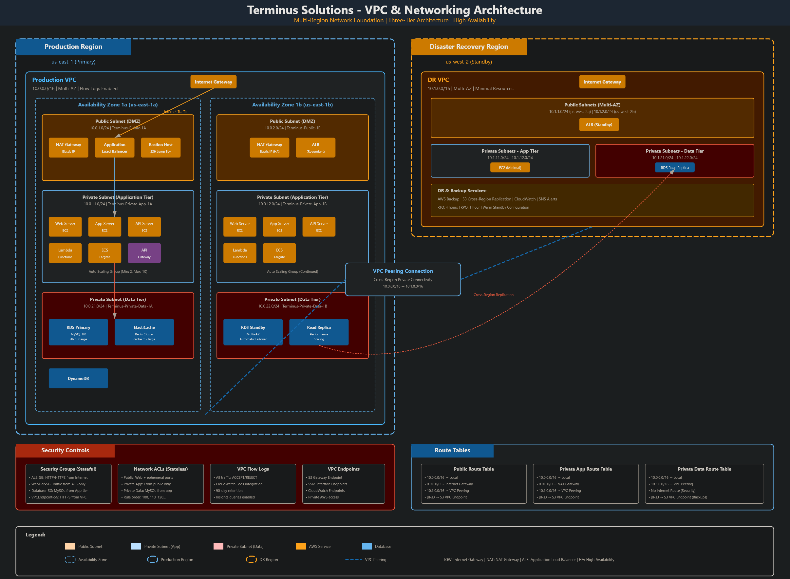
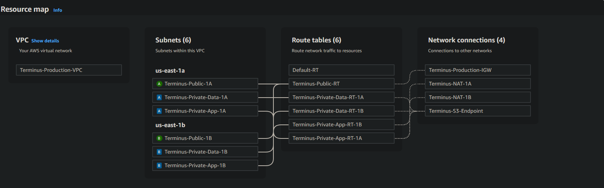
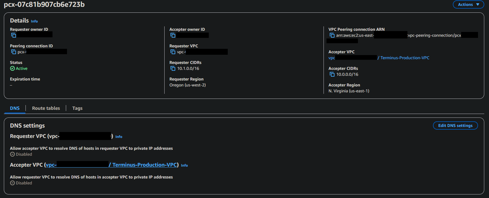
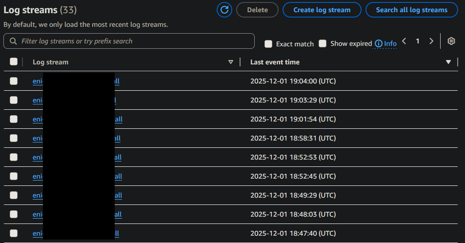

<!--
Terminus Solutions AWS Enterprise Architecture
Copyright (c) 2025 Jared (Terminus Solutions) - jaredintech.com
Licensed under CC BY-SA 4.0 - Attribution required
See LICENSE-DOCS for details
-->

#  Lab 2 - VPC & Networking Core

## 📑 Table of Contents

- [What I Built](#what-i-built)
- [Overview](#overview)
- [Architecture Decisions](#-architecture-decisions)
- [Architecture Diagram](#%EF%B8%8F-architecture-diagram)
- [Prerequisites](#-prerequisites)
- [Cost Considerations](#-cost-considerations)
- [Components Created](#-components-created)
- [Implementation Notes](#-implementation-notes)
- [Challenges & Solutions](#-challenges--solutions)
- [Proof It Works](#-proof-it-works)
- [Testing & Validation](#-testing--validation)
- [Next Steps](#-next-steps)
- [Project Navigation](#-project-navigation)

## What I Built

In this lab, I created a production-grade, multi-region network infrastructure for Terminus Solutions. I built a three-tier VPC architecture in us-east-1 (Production) and us-west-2 (DR) with complete subnet segmentation, redundant NAT Gateways, cross-region VPC peering, comprehensive security controls with NACLs and Security Groups, and VPC endpoints for private AWS service access.

> **Security Note:** All sensitive network configurations, IP ranges, and security group IDs in this repository are **redacted or fictional** for security compliance.

## Overview

### Why This Lab Matters

If Lab 1 is the security backbone, Lab 2 is the circulatory system. Every packet of data in your AWS environment flows through the network architecture you design here. Get it wrong, and you face:
- Security breaches from misconfigured access controls
- Unexpected costs from inefficient data transfer paths
- Downtime from single points of failure
- Compliance failures from improper network isolation

Get it right, and you have a foundation that scales from startup to enterprise without re-architecture.

### The Enterprise Thinking

**Why multi-region instead of multi-AZ only?**

Multi-AZ handles datacenter failures. Multi-region handles regional disasters (and they happen). AWS us-east-1 has experienced multiple significant outages. When your competitor is down and you're serving traffic from us-west-2, that's a business advantage money can't buy retroactively.

But multi-region isn't free. It adds complexity, cost, and operational overhead. The key is designing the network so DR *can* activate, not necessarily that it's always hot. Our VPC peering connection sits ready. Database replication flows continuously. When we need it, the network path exists.

**Why three tiers instead of two?**

Two-tier architectures (public/private) are simpler. But they force a choice: does your database sit in the same subnet as your application servers?

If yes, your database has a route to the NAT Gateway, and therefore a path to the internet. That's an attack vector. That's a compliance finding. That's a conversation with auditors you don't want to have.

Three tiers create true isolation:
- **Public**: Load balancers, NAT Gateways. Internet-facing by design.
- **Application**: Compute resources. Outbound internet via NAT for updates and API calls. No inbound from internet.
- **Data**: Databases, caches, sensitive storage. No route to internet whatsoever. To exfiltrate data, an attacker must compromise multiple layers.

**Why NAT Gateways per Availability Zone?**

A single NAT Gateway is a single point of failure, and a cross-AZ data transfer cost.

When us-east-1a's NAT Gateway serves traffic from us-east-1b, you pay $0.01/GB for cross-AZ transfer. More critically, if that AZ fails, your entire private subnet fleet loses internet access. No updates, no external API calls, no outbound anything.

NAT Gateway per AZ costs more ($32.85/month each). But it provides:
- AZ isolation: one AZ failure doesn't cascade
- Cost efficiency: traffic stays within AZ
- Performance: lower latency, no cross-AZ hop

For production workloads, this isn't optional.

**Why VPC Peering instead of Transit Gateway?**

Transit Gateway is the "enterprise" choice, but enterprise doesn't mean "always better."

For two regions, VPC peering is:
- **Cheaper**: $0/month vs ~$73/month for Transit Gateway
- **Simpler**: Direct connection, no hub to manage
- **Sufficient**: We don't need transitive routing yet

Transit Gateway makes sense at 4+ regions when the peering mesh becomes unmanageable. We've designed our CIDR allocation (ADR-002) to support future Transit Gateway migration. But today, peering is the right tool.

**Why both Security Groups AND Network ACLs?**

They serve different purposes:

*Security Groups* are stateful and instance-level. They're your application-aware firewall. "Web servers accept traffic from the load balancer security group" is a rule that automatically updates as instances scale.

*Network ACLs* are stateless and subnet-level. They're your network perimeter. "Nothing on port 22 enters the data subnet, ever" is a rule that applies regardless of what instances exist.

Using both implements defense in depth. A misconfigured security group doesn't expose your database if the NACL blocks the port. A permissive NACL doesn't matter if the security group denies the traffic.

**Why VPC Endpoints?**

Every gigabyte to S3 through a NAT Gateway costs $0.045 in processing fees. For a modest 4TB monthly S3 traffic, that's $180/month—just for the privilege of reaching an AWS service.

VPC Gateway Endpoints for S3 cost $0. The traffic stays on AWS's backbone, never touching your NAT Gateway. It's faster, cheaper, and more secure (traffic never leaves AWS's network).

Interface Endpoints for Systems Manager let us manage instances in private subnets without bastion hosts. No SSH keys floating around, no jump boxes to patch, no public IPs on management interfaces.

### What This Lab Creates
```
Production Region (us-east-1)                 DR Region (us-west-2)
┌─────────────────────────────────┐          ┌─────────────────────────────────┐
│  VPC: 10.0.0.0/16               │          │  VPC: 10.1.0.0/16               │
│  ┌─────────────────────────────┐│          │  ┌─────────────────────────────┐│
│  │ Public: 10.0.1.0/24 (AZ-1a) ││          │  │ Public: 10.1.1.0/24 (AZ-2a) ││
│  │ Public: 10.0.2.0/24 (AZ-1b) ││          │  │ Public: 10.1.2.0/24 (AZ-2b) ││
│  ├─────────────────────────────┤│          │  ├─────────────────────────────┤│
│  │ App: 10.0.11.0/24 (AZ-1a)   ││◄────────►│  │ App: 10.1.11.0/24 (AZ-2a)   ││
│  │ App: 10.0.12.0/24 (AZ-1b)   ││  Peering │  │ App: 10.1.12.0/24 (AZ-2b)   ││
│  ├─────────────────────────────┤│          │  ├─────────────────────────────┤│
│  │ Data: 10.0.21.0/24 (AZ-1a)  ││          │  │ Data: 10.1.21.0/24 (AZ-2a)  ││
│  │ Data: 10.0.22.0/24 (AZ-1b)  ││          │  │ Data: 10.1.22.0/24 (AZ-2b)  ││
│  └─────────────────────────────┘│          │  └─────────────────────────────┘│
└─────────────────────────────────┘          └─────────────────────────────────┘
```

This structure supports:
- **Blast radius containment** — A compromised application server cannot directly reach databases in another AZ
- **Cost-optimized traffic flow** — Same-AZ communication wherever possible
- **DR readiness** — Identical structure means identical deployment procedures
- **Compliance posture** — Clear network boundaries for PCI-DSS, HIPAA, SOC2 scoping

### The Foundation for Everything Else

Labs 3-13 deploy into this network:
- EC2 instances launch into application subnets with pre-configured security groups
- RDS deploys into data subnets with no internet exposure
- Load balancers attach to public subnets with proper routing
- Lambda functions (VPC-attached) use the application tier
- ECS/EKS clusters leverage the subnet structure for pod networking

The decisions made here ripple through every subsequent lab. That's why we documented five ADRs for networking alone.

## 📐 Architecture Decisions

This lab implements several significant architectural decisions:

- **[ADR-002: VPC CIDR Allocation Strategy](../../architecture/decisions/adr-002-vpc-cidr-allocation-strategy.md)** - Hierarchical IP addressing scheme using 10.0.0.0/8
- **[ADR-003: Network Segmentation Architecture](../../architecture/decisions/adr-003-network-segmentation-architecture.md)** - Three-tier subnet design with security isolation
- **[ADR-004: Multi-Region DR Network Design](../../architecture/decisions/adr-004-multi-region-dr-network-design.md)** - VPC Peering vs Transit Gateway decision
- **[ADR-005: Network Security Controls Strategy](../../architecture/decisions/adr-005-network-security-controls-strategy.md)** - Defense-in-depth with NACLs and Security Groups
- **[ADR-006: VPC Endpoints and Private Connectivity](../../architecture/decisions/adr-006-vpc-endpoints-private-connectivity.md)** - Private AWS service access patterns

## 🏗️ Architecture Diagram



## ✅ Prerequisites

- ✅ Completed Lab 1 (IAM & Organizations)
- ✅ Access to Production and Development accounts
- ✅ Understanding of IP addressing and subnetting
- ✅ Basic knowledge of routing concepts

## 💰 Cost Considerations

**USD**: ~$5-10 for this lab (primarily NAT Gateway costs)

### Key Cost Drivers:
- **NAT Gateways**: $0.045/hour per gateway (2 in production, 2 in DR)
- **VPC Peering**: No hourly charges, data transfer at $0.02/GB cross-region
- **VPC Endpoints**: Interface endpoints at $0.01/hour each
- **Data Transfer**: Cross-AZ at $0.01/GB, cross-region at $0.02/GB

Refer to [Cost Analysis](./docs/lab-02-costs.md) for detailed breakdown and optimization strategies.  
Refer to [Network Costs](../../architecture/cost-analysis/network-costs.md) for in-depth architectural cost analysis pertaining to organizations at greater scale.

## 🔐 Components Created

### VPCs and Subnets
- **Production VPC** (10.0.0.0/16) in us-east-1
  - Public Subnets: 10.0.1.0/24, 10.0.2.0/24
  - Private App Subnets: 10.0.11.0/24, 10.0.12.0/24
  - Private Data Subnets: 10.0.21.0/24, 10.0.22.0/24
- **DR VPC** (10.1.0.0/16) in us-west-2
  - Matching subnet structure for disaster recovery

### Security Components
- **Security Groups**:
  - `Terminus-ALB-SG` - Internet-facing load balancer
  - `Terminus-WebTier-SG` - Application servers
  - `Terminus-Database-SG` - Database tier (no internet access)
- **Network ACLs**:
  - Custom NACLs per tier with stateless rules
  - Ephemeral port handling for return traffic

### Connectivity
- **Internet Gateways** - One per VPC
- **NAT Gateways** - Redundant gateways per AZ (4 total)
- **VPC Peering** - Cross-region connection for DR
- **VPC Endpoints** - S3 Gateway endpoint, SSM Interface endpoints

### Monitoring
- **VPC Flow Logs** - Comprehensive traffic monitoring to CloudWatch
- **CloudWatch Log Groups** - 90-day retention for compliance

## 📝 Implementation Notes

### Key Steps

**Time Investment**: 4 hours implementation + 1 hour testing + 2 hours documentation

1. **Created Production VPC with Multi-AZ Design**
```bash
   # Used "VPC and more" to create complete infrastructure
   # 2 AZs, 6 subnets total, redundant NAT Gateways
```

2. **Implemented Three-Tier Security Architecture**
```yaml
   Public Tier: Internet-facing components (ALB, NAT GW)
   Application Tier: Private subnets with outbound internet via NAT
   Data Tier: Isolated subnets with no internet routing
```

3. **Established Cross-Region DR Connectivity**
```json
   # VPC Peering configuration
   {
     "Production": "10.0.0.0/16",
     "DR": "10.1.0.0/16",
     "Connection": "Cross-region peering with DNS resolution"
   }
```

4. **Configured Defense-in-Depth Security**
```
   Layer 1: Network ACLs (subnet-level, stateless)
   Layer 2: Security Groups (instance-level, stateful)
   Layer 3: VPC Endpoints (private AWS service access)
   Layer 4: Flow Logs (comprehensive monitoring)
```

### Important Configurations
```yaml
# Key configuration values
Production VPC: 10.0.0.0/16 (us-east-1)
DR VPC: 10.1.0.0/16 (us-west-2)
Availability Zones: 2 per region
NAT Gateways: 1 per AZ (4 total)
Route Tables: 6 custom tables with tier-specific routing
Security Groups: 6 (3 per region)
Network ACLs: 3 custom (Public, App, Data)
VPC Endpoints: S3 Gateway, SSM/EC2Messages/SSMMessages Interface
Flow Logs: All traffic captured to CloudWatch
```

## 🚧 Challenges & Solutions

### Challenge 1: Complex NACL Rules for Stateless Traffic
**Solution**: Added ephemeral port ranges (1024-65535) for return traffic. Created detailed inbound/outbound rules per tier. Documented traffic flow patterns for troubleshooting.

### Challenge 2: Cross-Region Security Group References
**Solution**: Security groups can't reference cross-region. Used CIDR blocks for cross-region access (10.0.11.0/24 → 10.1.11.0/24). Created documentation matrix for IP-based rules.

### Challenge 3: VPC Endpoint DNS Resolution
**Solution**: Enabled DNS hostnames and resolution on VPCs. Created endpoint-specific security group. Verified with `nslookup` from private instances.

### Challenge 4: Route Table Propagation for Peering
**Solution**: Manually added routes in all route tables (no auto-propagation). Created routing matrix documentation. Tested with cross-region ping after peering.

## ✨ Proof It Works

### 🧪 Test Results
```bash
# Cross-region connectivity test
$ ping 10.1.11.5 -c 4
PING 10.1.11.5: 56 data bytes
64 bytes from 10.1.11.5: icmp_seq=0 ttl=64 time=67.2 ms
64 bytes from 10.1.11.5: icmp_seq=1 ttl=64 time=66.8 ms

# VPC Endpoint test (S3 via private network)
$ aws s3 ls --endpoint-url https://s3.us-east-1.amazonaws.com
2025-06-12 08:15:23 terminus-production-data
2025-06-12 08:15:45 terminus-application-logs
```

### 📸 Screenshots

*Multi-AZ VPC with complete subnet architecture*


*Active cross-region peering connection*


*VPC Flow Logs capturing all network traffic*

## 🔧 Testing & Validation

### Network Connectivity Matrix

|Source|Destination|Port|Protocol|Result|
|---|---|---|---|---|
|Internet|ALB (Public Subnet)|80,443|TCP|✅ Allow|
|ALB|Web Tier (Private)|80,443|TCP|✅ Allow|
|Web Tier|Database Tier|3306|TCP|✅ Allow|
|Database Tier|Internet|All|All|❌ Deny|
|Production VPC|DR VPC|All|All|✅ Allow (Peering)|

### Security Validation
- ✅ Database subnets have no internet route
- ✅ NACLs enforce subnet-level restrictions
- ✅ Security groups use least-privilege access
- ✅ VPC endpoints eliminate internet routing for AWS services

**For complete testing procedures, see [Network Testing Checklist](./docs/network-testing-checklist.md).**  
**For common issues and troubleshooting, see [VPC & Networking Troubleshooting](./docs/lab-02-troubleshooting.md).**

## 🚀 Next Steps

- [x] Lab 1: IAM & Organizations Foundation
- [x] Lab 2: VPC & Networking Core
- [ ] Lab 3: EC2 & Auto Scaling Platform (Network foundation ready!)
- [ ] Lab 4: S3 & Storage Strategy (VPC endpoints configured!)

### Integration Points Ready
- ✅ Application subnets ready for EC2 deployment
- ✅ Database subnets configured for RDS Multi-AZ
- ✅ Public subnets prepared for load balancers
- ✅ VPC endpoints ready for private S3/Systems Manager access

---

### 📊 Project Navigation

| Lab | Component | Status | Documentation |
|-----|-----------|--------|---------------|
| 1 | IAM & Organizations | ✅ Complete | [View](/labs/lab-01-iam/README.md) |
| 2 | VPC & Networking Core | ✅ Complete | **You are here** |
| 3 | EC2 & Auto Scaling Platform | ✅ Complete | [View](/labs/lab-03-ec2/README.md) |
| 4 | S3 & Storage Strategy | ✅ Complete | [View](/labs/lab-04-s3/README.md) |
| 5 | RDS & Database Services | 📅 Planned | - |
| 6 | Route53 & CloudFront Distribution | 📅 Planned | - |
| 7 | ELB & High Availability | 📅 Planned | - |
| 8 | Lambda & API Gateway Services | 📅 Planned | - |
| 9 | SQS, SNS & EventBridge Messaging | 📅 Planned | - |
| 10 | CloudWatch & Systems Manager Monitoring | 📅 Planned | - |
| 11 | CloudFormation Infrastructure as Code | 📅 Planned | - |
| 12 | Security Services Integration | 📅 Planned | - |
| 13 | Container Services (ECS/EKS) | 📅 Planned | - |

*Last Updated: December 10, 2025*