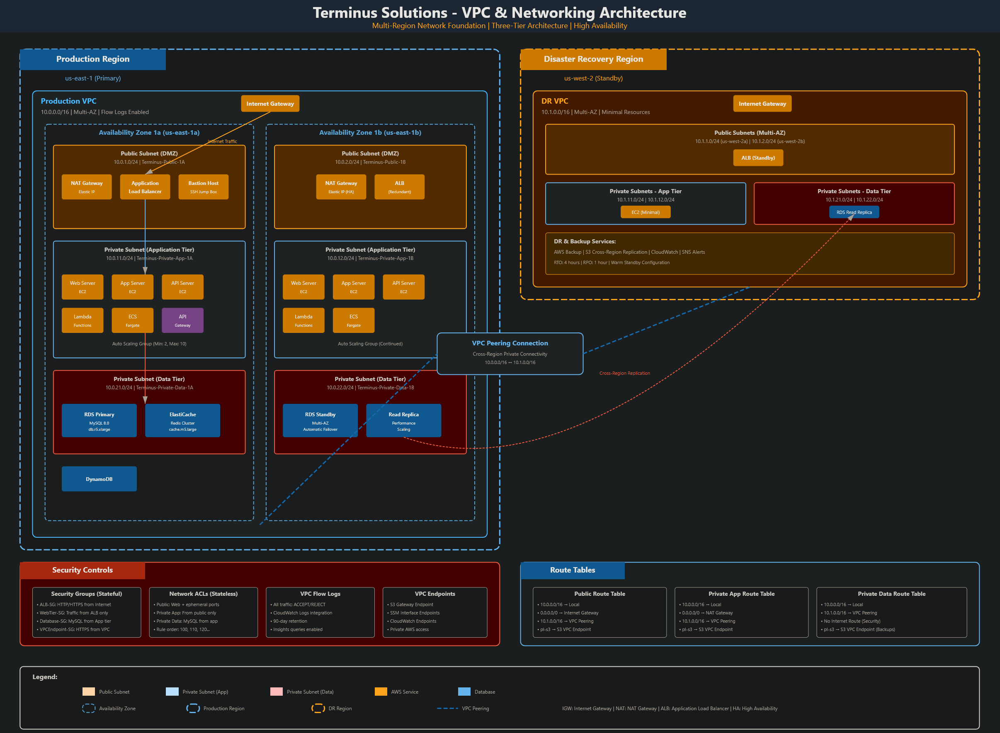
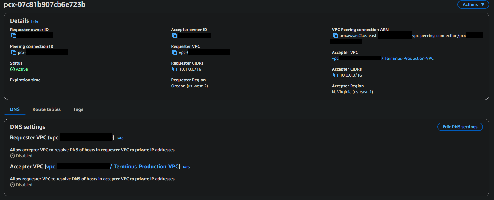

<!--
Terminus Solutions AWS Enterprise Architecture
Copyright (c) 2024 Jared (Terminus Solutions) - jaredintech.com
Licensed under CC BY-SA 4.0 - Attribution required
See LICENSE-DOCS for details
-->

#  Lab 2 - VPC & Networking Core

## What I Built

In this lab, I established the complete network foundation for Terminus Solutions' cloud infrastructure. I created a production-grade, multi-region VPC architecture with a primary production VPC in us-east-1 and a disaster recovery VPC in us-west-2. The implementation includes a three-tier network design (public DMZ, private application, and private data tiers), multi-AZ high availability with redundant NAT Gateways, cross-region VPC peering for disaster recovery, comprehensive security controls with NACLs and Security Groups, and VPC Flow Logs for network monitoring.

> **Security Note:** All AWS account IDs, email addresses, and sensitive information in this repository are **redacted or fictional** for security compliance.

## Architecture



The architecture implements a multi-region, multi-AZ network design with:
- Production VPC (10.0.0.0/16) in us-east-1 with 6 subnets across 2 AZs
- DR VPC (10.1.0.0/16) in us-west-2 with identical subnet structure
- VPC Peering for secure cross-region connectivity
- Three-tier subnet design: Public (DMZ), Private Application, and Private Data
- Redundant NAT Gateways in each AZ for high availability
- VPC Endpoints for private AWS service access (S3, Systems Manager)

## Prerequisites

- ✅ Completed Lab 1 (IAM & Organizations Foundation)
- ✅ Access to Production and Development accounts via cross-account roles
- ✅ Understanding of IP addressing and CIDR notation
- ✅ Basic knowledge of routing concepts

## Cost Considerations

**Estimated Monthly Cost**: $90-120 USD

Primary cost drivers:
- NAT Gateways: ~$45/month per gateway (2 in production + 2 in DR = 4 total)
- VPC Endpoints (Interface): ~$7/month per endpoint per AZ
- Data Transfer: Cross-region peering charges at $0.02/GB
- VPC Flow Logs: CloudWatch storage charges

**Cost Optimization Applied**:
- Used Gateway endpoints for S3 (free) instead of Interface endpoints
- Consolidated Interface endpoints to only necessary services
- Configured appropriate Flow Log retention (90 days)

Refer to [Cost Considerations](./COST-CONSIDERATIONS.md) for detailed analysis.

## Implementation Notes

### Key Steps

1. **Designed IP Address Strategy**
   ```
   Production (us-east-1): 10.0.0.0/16
   - Public: 10.0.1.0/24, 10.0.2.0/24
   - Private App: 10.0.11.0/24, 10.0.12.0/24
   - Private Data: 10.0.21.0/24, 10.0.22.0/24
   
   DR (us-west-2): 10.1.0.0/16
   - Identical subnet design with 10.1.x.x addressing
   ```

2. **Created Production VPC Infrastructure**
   - Used "VPC and more" wizard for faster deployment
   - Configured DNS resolution and hostnames for private DNS
   - Deployed NAT Gateway in each AZ for redundancy

3. **Implemented Security Layers**
   - Security Groups: Stateful, instance-level protection
   - NACLs: Stateless, subnet-level defense in depth
   - VPC Flow Logs: Complete network traffic monitoring

4. **Established Cross-Region Connectivity**
   - VPC Peering between production and DR regions
   - Updated route tables in both VPCs
   - Configured security groups for cross-region database replication

### Important Configurations

```yaml
# Production VPC Configuration
VPC CIDR: 10.0.0.0/16
Region: us-east-1
AZs: us-east-1a, us-east-1b
NAT Gateways: 2 (one per AZ)
Internet Gateway: 1
VPC Endpoints: S3 (Gateway), SSM/EC2Messages/SSMMessages (Interface)

# DR VPC Configuration  
VPC CIDR: 10.1.0.0/16
Region: us-west-2
AZs: us-west-2a, us-west-2b
Configuration: Mirrors production for consistency

# Security Configuration
Security Groups: 6 (ALB, Web, Database per region)
NACLs: 3 custom (Public, Private App, Private Data)
Flow Logs: Enabled for all traffic, 90-day retention
```

## Challenges & Solutions

### Challenge 1: NAT Gateway High Availability vs Cost
**Problem**: Single NAT Gateway would save ~$45/month but creates single point of failure.
**Solution**: Deployed NAT Gateway per AZ for production reliability. Accepted higher cost for uptime requirements. In development environments, would use single NAT Gateway.

### Challenge 2: Security Group Cross-Region References
**Problem**: Cannot reference security group IDs across regions for VPC peering.
**Solution**: Used CIDR blocks instead of security group references for cross-region rules. Documented IP ranges clearly for maintenance. Created naming conventions for easy identification.

### Challenge 3: NACL Stateless Nature Causing Issues
**Problem**: Application responses blocked due to missing ephemeral port rules.
**Solution**: Added ephemeral port ranges (1024-65535) in both inbound and outbound NACL rules. Tested each tier's connectivity systematically. Created comprehensive rule documentation for future reference.

### Challenge 4: VPC Endpoint Cost Optimization
**Problem**: Interface endpoints charge ~$7/month per endpoint per AZ.
**Solution**: Used Gateway endpoints for S3 (free) instead of Interface endpoints. Consolidated Systems Manager endpoints to serve multiple purposes. Only deployed endpoints in AZs where needed.

## Proof It Works

### Network Connectivity Test Results
```bash
# Cross-subnet connectivity test
$ ping 10.0.21.5 from 10.0.11.10
PING 10.0.21.5 56(84) bytes of data.
64 bytes from 10.0.21.5: icmp_seq=1 ttl=64 time=0.341 ms

# NAT Gateway internet access test (from private subnet)
$ curl -I https://aws.amazon.com
HTTP/2 200
Connection successful via NAT Gateway

# Cross-region VPC peering test
$ ping 10.1.11.10 from 10.0.11.10
64 bytes from 10.1.11.10: icmp_seq=1 ttl=64 time=68.2 ms
```

### Screenshots

*Complete VPC infrastructure with all subnets and routing*


*Layered security group configuration for each tier*


*Cross-region peering connection established and active*

### VPC Flow Logs Query Results
```sql
# Top rejected connections (potential security events)
fields @timestamp, srcaddr, dstaddr, action
| filter action = "REJECT"
| stats count() by srcaddr
| sort count desc

Results show expected behavior with no unauthorized access attempts
```
### 📊 Access Matrix Testing

|Role|EC2 Launch|EC2 View|S3 Create|S3 Delete|RDS Create|
|---|---|---|---|---|---|
|TerminusDeveloperRole|✓ (t2/t3 only)|✓|✓ (dev buckets)|✓ (dev buckets)|✓ (t2/t3 only)|
|TerminusProductionReadOnlyRole|✗|✓|✗|✗|✗|

## 🔧 Troubleshooting

📚 **For detailed solutions and additional issues, see the complete [Troubleshooting Guide](./docs/lab-01-troubleshooting.md).**

## Next Steps

- [x] Lab 3: EC2 & Auto Scaling (Application tier deployment)
- [ ] Implement Transit Gateway for multi-VPC connectivity (future enhancement)
- [ ] Add Site-to-Site VPN for hybrid cloud scenario

---

### 📊 Project Navigation

| Lab | Component | Status | Documentation |
|-----|-----------|--------|---------------|
| 1 | IAM & Organizations | ✅ Complete | [View](/labs/lab-01-iam/README.md) |
| 2 | VPC & Networking Core | 🚧 In Progress | [View](/labs/lab-02-vpc/README.md) |
| 3 | EC2 & Auto Scaling Platform | 📅 Planned | - |
| 4 | S3 & Storage Strategy | 📅 Planned | - |
| 5 | RDS & Database Services | 📅 Planned | - |
| 6 | Route53 & CloudFront Distribution | 📅 Planned | - |
| 7 | ELB & High Availability | 📅 Planned | - |
| 8 | Lambda & API Gateway Services | 📅 Planned | - |
| 9 | SQS, SNS & EventBridge Messaging | 📅 Planned | - |
| 10 | CloudWatch & Systems Manager Monitoring | 📅 Planned | - |
| 11 | CloudFormation Infrastructure as Code | 📅 Planned | - |
| 12 | Security Services Integration | 📅 Planned | - |
| 13 | Container Services (ECS/EKS) | 📅 Planned | - |

---

*Lab Status: ✅ Complete*  
*Last Updated: June 11th, 2025*