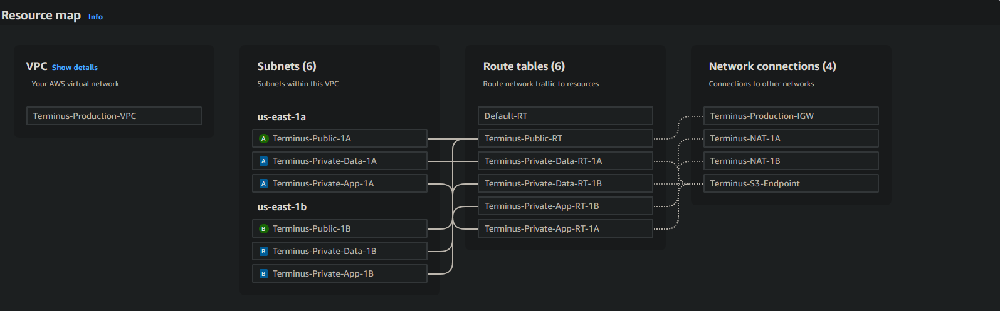
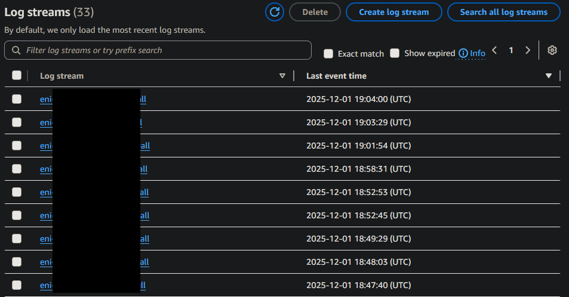

<!--
Terminus Solutions AWS Enterprise Architecture
Copyright (c) 2025 Jared (Terminus Solutions) - jaredintech.com
Licensed under CC BY-SA 4.0 - Attribution required
See LICENSE-DOCS for details
-->

#  Lab 2 - VPC & Networking Core

## What I Built

In this lab, I created a production-grade, multi-region network infrastructure for Terminus Solutions. I built a three-tier VPC architecture in us-east-1 (Production) and us-west-2 (DR) with complete subnet segmentation, redundant NAT Gateways, cross-region VPC peering, comprehensive security controls with NACLs and Security Groups, and VPC endpoints for private AWS service access.

> **Security Note:** All sensitive network configurations, IP ranges, and security group IDs in this repository are **redacted or fictional** for security compliance.

## 📐 Architecture Decisions

This lab implements several significant architectural decisions:

- **[ADR-002: VPC CIDR Allocation Strategy](../../architecture/decisions/adr-002-vpc-cidr-allocation-strategy.md)** - Hierarchical IP addressing scheme using 10.0.0.0/8
- **[ADR-003: Network Segmentation Architecture](../../architecture/decisions/adr-003-network-segmentation-architecture.md)** - Three-tier subnet design with security isolation
- **[ADR-004: Multi-Region DR Network Design](../../architecture/decisions/adr-004-multi-region-dr-network-design.md)** - VPC Peering vs Transit Gateway decision
- **[ADR-005: Network Security Controls Strategy](../../architecture/decisions/adr-005-network-security-controls-strategy.md)** - Defense-in-depth with NACLs and Security Groups
- **[ADR-006: VPC Endpoints and Private Connectivity](../../architecture/decisions/adr-006-vpc-endpoints-private-connectivity.md)** - Private AWS service access patterns

## 🏗️ Architecture Diagram


## ✅ Prerequisites

- ✅ Completed Lab 1 (IAM & Organizations)
- ✅ Access to Production and Development accounts
- ✅ Understanding of IP addressing and subnetting
- ✅ Basic knowledge of routing concepts

## 💰 Cost Considerations

**USD**: ~$5-10 for this lab (primarily NAT Gateway costs)

### Key Cost Drivers:
- **NAT Gateways**: $0.045/hour per gateway (2 in production, 2 in DR)
- **VPC Peering**: No hourly charges, data transfer at $0.02/GB cross-region
- **VPC Endpoints**: Interface endpoints at $0.01/hour each
- **Data Transfer**: Cross-AZ at $0.01/GB, cross-region at $0.02/GB

Refer to [Cost Analysis](./docs/lab-02-costs.md) for detailed breakdown and optimization strategies.  
Refer to [Network Costs](../../architecture/cost-analysis/network-costs.md) for in-depth architectural cost analysis pertaining to organizations at greater scale.

## 🔐 Network Components Created

### VPCs and Subnets
- **Production VPC** (10.0.0.0/16) in us-east-1
  - Public Subnets: 10.0.1.0/24, 10.0.2.0/24
  - Private App Subnets: 10.0.11.0/24, 10.0.12.0/24
  - Private Data Subnets: 10.0.21.0/24, 10.0.22.0/24
- **DR VPC** (10.1.0.0/16) in us-west-2
  - Matching subnet structure for disaster recovery

### Security Components
- **Security Groups**:
  - `Terminus-ALB-SG` - Internet-facing load balancer
  - `Terminus-WebTier-SG` - Application servers
  - `Terminus-Database-SG` - Database tier (no internet access)
- **Network ACLs**:
  - Custom NACLs per tier with stateless rules
  - Ephemeral port handling for return traffic

### Connectivity
- **Internet Gateways** - One per VPC
- **NAT Gateways** - Redundant gateways per AZ (4 total)
- **VPC Peering** - Cross-region connection for DR
- **VPC Endpoints** - S3 Gateway endpoint, SSM Interface endpoints

### Monitoring
- **VPC Flow Logs** - Comprehensive traffic monitoring to CloudWatch
- **CloudWatch Log Groups** - 90-day retention for compliance

## 📝 Implementation Notes

### Key Steps

**Time Investment**: 4 hours implementation + 1 hour testing + 2 hours documentation

1. **Created Production VPC with Multi-AZ Design**
   ```bash
   # Used "VPC and more" to create complete infrastructure
   # 2 AZs, 6 subnets total, redundant NAT Gateways
   ```

2. **Implemented Three-Tier Security Architecture**
   ```yaml
   Public Tier: Internet-facing components (ALB, NAT GW)
   Application Tier: Private subnets with outbound internet via NAT
   Data Tier: Isolated subnets with no internet routing
   ```

3. **Established Cross-Region DR Connectivity**
   ```json
   # VPC Peering configuration
   {
     "Production": "10.0.0.0/16",
     "DR": "10.1.0.0/16",
     "Connection": "Cross-region peering with DNS resolution"
   }
   ```

4. **Configured Defense-in-Depth Security**
   ```
   Layer 1: Network ACLs (subnet-level, stateless)
   Layer 2: Security Groups (instance-level, stateful)
   Layer 3: VPC Endpoints (private AWS service access)
   Layer 4: Flow Logs (comprehensive monitoring)
   ```

### Important Configurations

```yaml
# Key configuration values
Production VPC: 10.0.0.0/16 (us-east-1)
DR VPC: 10.1.0.0/16 (us-west-2)
Availability Zones: 2 per region
NAT Gateways: 1 per AZ (4 total)
Route Tables: 6 custom tables with tier-specific routing
Security Groups: 6 (3 per region)
Network ACLs: 3 custom (Public, App, Data)
VPC Endpoints: S3 Gateway, SSM/EC2Messages/SSMMessages Interface
Flow Logs: All traffic captured to CloudWatch
```

## 🚧 Challenges & Solutions

### Challenge 1: Complex NACL Rules for Stateless Traffic
**Solution**: Added ephemeral port ranges (1024-65535) for return traffic. Created detailed inbound/outbound rules per tier. Documented traffic flow patterns for troubleshooting.

### Challenge 2: Cross-Region Security Group References
**Solution**: Security groups can't reference cross-region. Used CIDR blocks for cross-region access (10.0.11.0/24 → 10.1.11.0/24). Created documentation matrix for IP-based rules.

### Challenge 3: VPC Endpoint DNS Resolution
**Solution**: Enabled DNS hostnames and resolution on VPCs. Created endpoint-specific security group. Verified with `nslookup` from private instances.

### Challenge 4: Route Table Propagation for Peering
**Solution**: Manually added routes in all route tables (no auto-propagation). Created routing matrix documentation. Tested with cross-region ping after peering.

## ✨ Proof It Works

### 🧪 Test Results
```bash
# Cross-region connectivity test
$ ping 10.1.11.5 -c 4
PING 10.1.11.5: 56 data bytes
64 bytes from 10.1.11.5: icmp_seq=0 ttl=64 time=67.2 ms
64 bytes from 10.1.11.5: icmp_seq=1 ttl=64 time=66.8 ms

# VPC Endpoint test (S3 via private network)
$ aws s3 ls --endpoint-url https://s3.us-east-1.amazonaws.com
2025-06-12 08:15:23 terminus-production-data
2025-06-12 08:15:45 terminus-application-logs
```

### 📸 Screenshots

*Multi-AZ VPC with complete subnet architecture*


*Active cross-region peering connection*


*VPC Flow Logs capturing all network traffic*

## 🔧 Testing & Validation

### Network Connectivity Matrix

|Source|Destination|Port|Protocol|Result|
|---|---|---|---|---|
|Internet|ALB (Public Subnet)|80,443|TCP|✅ Allow|
|ALB|Web Tier (Private)|80,443|TCP|✅ Allow|
|Web Tier|Database Tier|3306|TCP|✅ Allow|
|Database Tier|Internet|All|All|❌ Deny|
|Production VPC|DR VPC|All|All|✅ Allow (Peering)|

### Security Validation
- ✅ Database subnets have no internet route
- ✅ NACLs enforce subnet-level restrictions
- ✅ Security groups use least-privilege access
- ✅ VPC endpoints eliminate internet routing for AWS services

**For complete testing procedures, see [Network Testing Checklist](./docs/network-testing-checklist.md).**  
**For common issues and troubleshooting, see [VPC & Networking Troubleshooting](./docs/lab-02-troubleshooting.md).**

## 🚀 Next Steps

- [x] Lab 1: IAM & Organizations Foundation
- [x] Lab 2: VPC & Networking Core
- [ ] Lab 3: EC2 & Auto Scaling Platform (Network foundation ready!)
- [ ] Lab 4: S3 & Storage Strategy (VPC endpoints configured!)

### Integration Points Ready
- ✅ Application subnets ready for EC2 deployment
- ✅ Database subnets configured for RDS Multi-AZ
- ✅ Public subnets prepared for load balancers
- ✅ VPC endpoints ready for private S3/Systems Manager access

---

### 📊 Project Navigation

| Lab | Component | Status | Documentation |
|-----|-----------|--------|---------------|
| 1 | IAM & Organizations | ✅ Complete | [View](/labs/lab-01-iam/README.md) |
| 2 | VPC & Networking Core | ✅ Complete | **📍You are here** |  <!-- Highlight current --> |
| 3 | EC2 & Auto Scaling Platform | 📅 Planned | - |
| 4 | S3 & Storage Strategy | 📅 Planned | - |
| 5 | RDS & Database Services | 📅 Planned | - |
| 6 | Route53 & CloudFront Distribution | 📅 Planned | - |
| 7 | ELB & High Availability | 📅 Planned | - |
| 8 | Lambda & API Gateway Services | 📅 Planned | - |
| 9 | SQS, SNS & EventBridge Messaging | 📅 Planned | - |
| 10 | CloudWatch & Systems Manager Monitoring | 📅 Planned | - |
| 11 | CloudFormation Infrastructure as Code | 📅 Planned | - |
| 12 | Security Services Integration | 📅 Planned | - |
| 13 | Container Services (ECS/EKS) | 📅 Planned | - |

---

*Lab Status: ✅ Complete*  
*Last Updated: June 12th, 2025*