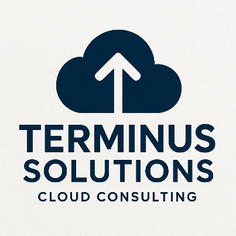
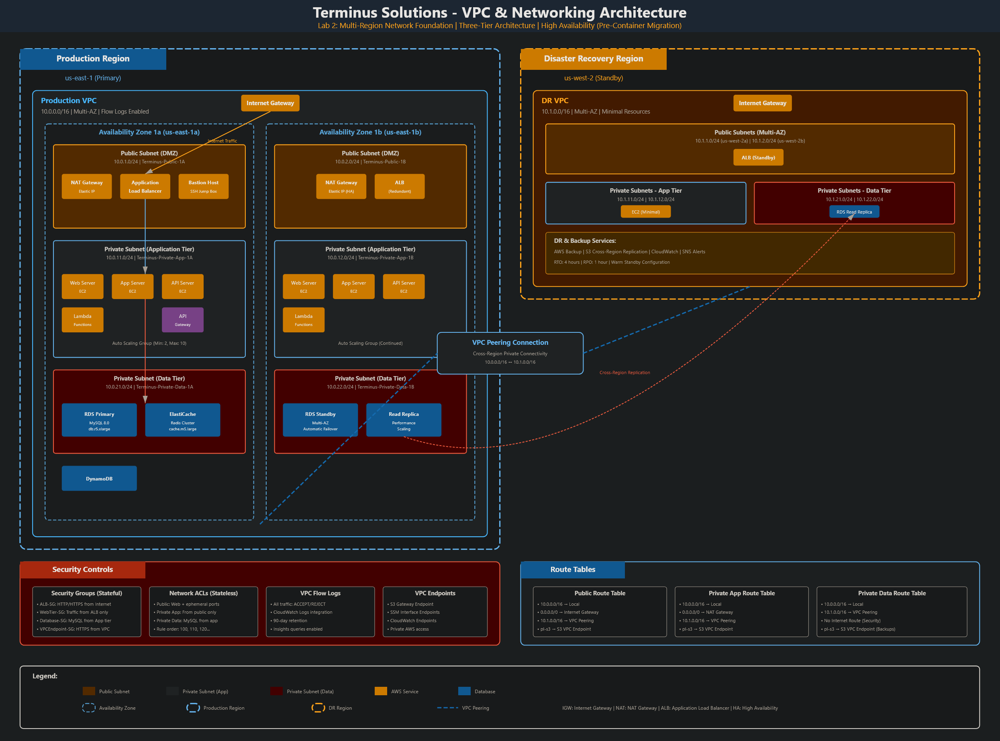
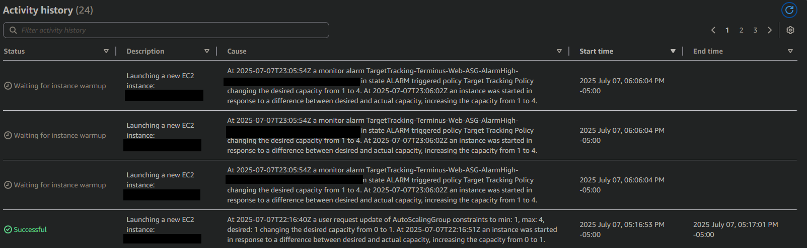
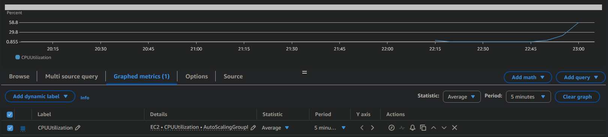
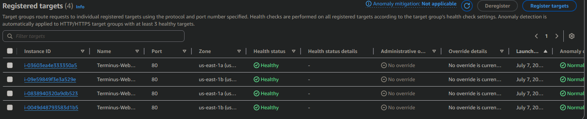

<!--
Terminus Solutions AWS Enterprise Architecture
Copyright (c) 2025 Jared (Terminus Solutions) - jaredintech.com
Licensed under CC BY-SA 4.0 - Attribution required
See LICENSE-DOCS for details
-->

#  Lab 3 - EC2 & Auto Scaling Platform

## 📑 Table of Contents

- [What I Built](#what-i-built)
- [Overview](#overview)
- [Architecture Decisions](#-architecture-decisions)
- [Architecture Diagram](#%EF%B8%8F-architecture-diagram)
- [Prerequisites](#-prerequisites)
- [Cost Considerations](#-cost-considerations)
- [Components Created](#-components-created)
- [Implementation Notes](#-implementation-notes)
- [Challenges & Solutions](#-challenges--solutions)
- [Proof It Works](#-proof-it-works)
- [Testing & Validation](#-testing--validation)
- [Next Steps](#-next-steps)
- [Project Navigation](#-project-navigation)

## What I Built

In this lab, I created a production-grade, auto-scaling compute platform for Terminus Solutions. I built a multi-tier EC2 architecture with web and application servers, implemented Auto Scaling Groups with dynamic scaling policies, configured Launch Templates with versioning, set up IAM instance profiles for secure AWS access, integrated Application Load Balancer target groups, and established cross-AZ high availability with self-healing infrastructure.

> **Security Note:** All AWS account IDs, instance IDs, and sensitive information in this repository are **redacted or fictional** for security compliance.

## Overview

### Why This Lab Matters

Lab 1 built the security backbone. Lab 2 created the circulatory system. Lab 3 is the muscle—the actual compute capacity that processes requests, runs applications, and serves customers.

But here's the trap most teams fall into: they treat compute as "just launch some EC2 instances." Then traffic spikes, instances crash, and suddenly it's 3 AM and you're manually scaling infrastructure while customers hit error pages.

Get compute architecture wrong, and you face:
- Availability gaps when demand exceeds capacity
- Wasted spend when capacity exceeds demand
- Security exposure from over-permissioned instances
- Operational chaos from manual scaling and patching

Get it right, and your infrastructure breathes with your business—scaling up for Black Friday, scaling down at 2 AM, healing itself when instances fail, all without human intervention.

### The Enterprise Thinking

**Why Auto Scaling Groups instead of static instances?**

Static instances are a bet. You're betting that Tuesday's traffic looks like Saturday's traffic looks like the traffic during your product launch. You're almost certainly wrong.

Auto Scaling isn't about saving money (though it does). It's about availability. When an instance fails a health check, ASG replaces it automatically. When CPU hits 70%, ASG adds capacity before users notice latency. When traffic drops, ASG removes instances you're not using.

The alternative is pagers, runbooks, and humans making decisions at 3 AM. Humans make mistakes at 3 AM. ASG doesn't.

**Why Launch Templates over Launch Configurations?**

Launch Configurations were fine in 2015. Launch Templates are what AWS recommends now, and for good reason.

Templates support versioning—you can roll back a bad configuration without recreating everything. They support mixed instance types for Spot integration. They support inheritance, so your web tier and app tier can share base configurations while diverging where needed.

Launch Configurations are frozen in time. Launch Templates evolve with your architecture.

**Why instance profiles instead of embedded credentials?**

Somewhere in a codebase, there's an AWS access key committed to a repository. It's been rotated three times, and nobody's quite sure if the old keys are still in a Lambda somewhere.

Instance profiles eliminate this entire category of problem. The instance assumes a role. The role grants permissions. When the instance terminates, the credentials vanish. There's no key to rotate, no secret to leak, no credential to manage.

Every application running on EC2 should access AWS services via instance profiles. If you're passing credentials in user data, through environment variables, or in configuration files, you're creating technical debt that will eventually become a security incident.

**Why Systems Manager instead of SSH bastion hosts?**

Bastion hosts are attack surface. They need patching, monitoring, and access control. They require key management—who has the private keys, where are they stored, how do you revoke access?

Systems Manager Session Manager eliminates all of this. No SSH ports open. No keys to manage. Full session logging to CloudTrail. IAM-controlled access that integrates with your existing identity story.

The security team stops asking "who has SSH access?" because the answer is in IAM, audited in CloudTrail, and requires no standing network access.

**Why separate web and application tiers?**

A single-tier architecture puts everything in the same blast radius. When you scale web capacity, you scale application capacity whether you need it or not. When application servers need database credentials, web servers have them too.

Two tiers create natural boundaries. Web servers handle HTTP, terminate TLS, and serve static content. Application servers run business logic and talk to databases. They scale independently, secure independently, and fail independently.

This isn't complexity for its own sake. It's the minimum viable separation that enables different scaling policies, different security postures, and different operational patterns.

### What This Lab Creates

```
                              Internet
                                 │
                          ┌──────┴──────┐
                          │     ALB     │
                          │ (Port 80/443)│
                          └──────┬──────┘
                                 │
          ┌──────────────────────┴──────────────────────┐
          │            Auto Scaling Group               │
          │              (Web Tier)                     │
          │  ┌─────────────────┬─────────────────┐      │
          │  │     AZ-1a       │      AZ-1b      │      │
          │  │   ┌─────────┐   │   ┌─────────┐   │      │
          │  │   │ Web-1   │   │   │ Web-2   │   │      │
          │  │   │t3.micro │   │   │t3.micro │   │      │
          │  │   └─────────┘   │   └─────────┘   │      │
          │  └─────────────────┴─────────────────┘      │
          │            Min: 2, Max: 6                   │
          └─────────────────────────────────────────────┘
                                 │
          ┌──────────────────────┴──────────────────────┐
          │          Application Tier                   │
          │  ┌─────────────────┬─────────────────┐      │
          │  │     AZ-1a       │      AZ-1b      │      │
          │  │   ┌─────────┐   │   ┌─────────┐   │      │
          │  │   │ App-1   │   │   │ App-2   │   │      │
          │  │   │t3.small │   │   │t3.small │   │      │
          │  │   │ EBS:20GB│   │   │ EBS:20GB│   │      │
          │  │   └─────────┘   │   └─────────┘   │      │
          │  └─────────────────┴─────────────────┘      │
          └─────────────────────────────────────────────┘
                                 │
                          ┌──────┴──────┐
                          │  Data Tier  │
                          │  (Lab 5)    │
                          └─────────────┘
```

This structure supports:
- **Automatic healing** — Failed instances are replaced without human intervention
- **Demand-based scaling** — Capacity matches traffic, not guesswork
- **Cost optimization** — Pay for what you use, not what you might need
- **Zero-touch operations** — CloudWatch triggers scaling, not operators

### The Foundation for Everything Else

Labs 4-13 integrate with this compute layer:

- **S3 (Lab 4)** instances access buckets via IAM roles configured here
- **RDS (Lab 5)** databases receive connections from application tier instances
- **ELB (Lab 7)** distributes traffic to our target groups and health checks
- **Lambda (Lab 8)** functions can invoke application tier endpoints
- **CloudWatch (Lab 10)** monitors the metrics and logs we're publishing
- **CloudFormation (Lab 11)** codifies the launch templates and ASG configurations

The compute layer is where applications live. Every subsequent lab either feeds into it, monitors it, or extends it. The patterns established here—instance profiles, launch templates, target tracking scaling—become the baseline for everything that runs on EC2.

## 📐 Architecture Decisions

This lab implements the following architectural decisions:

- **[ADR-007: Compute Platform Architecture](../../architecture/decisions/adr-007-compute-platform-architecture.md)** - Multi-tier compute design with Auto Scaling Groups and Launch Templates
- **[ADR-008: AMI Management Strategy](../../architecture/decisions/adr-008-ami-management-strategy.md)** - Golden AMI approach with versioning and lifecycle management
- **[ADR-009: Instance Profile Security](../../architecture/decisions/adr-009-instance-profile-security.md)** - IAM instance profiles with role-based access control
- **[ADR-010: Auto Scaling Strategy](../../architecture/decisions/adr-010-auto-scaling-strategy.md)** - Multi-dimensional scaling with target tracking and step policies
- **[ADR-011: Storage Performance Optimization](../../architecture/decisions/adr-011-storage-performance-optimization.md)** - Tiered EBS gp3 storage with automated snapshot lifecycle

## 🏗️ Architecture Diagram



The architecture implements a two-tier compute design with Auto Scaling Groups managing web tier capacity, Application Load Balancer distributing traffic across availability zones, and static application tier instances for backend processing. All instances use IAM instance profiles for AWS service access and Systems Manager for secure, keyless management.

## ✅ Prerequisites

- ✅ Completed Lab 1 (IAM & Organizations) with cross-account access working
- ✅ Completed Lab 2 (VPC & Networking) with all subnets and security groups configured
- ✅ Access to the Production account
- ✅ Basic understanding of web server concepts

## 💰 Cost Considerations

**USD**: ~$5-10 for this lab (primarily from running t3.micro/t3.small instances)

### Key Cost Drivers:
- **EC2 Instances**: t3.micro at ~$0.0104/hour, t3.small at ~$0.0208/hour
- **Application Load Balancer**: ~$0.0225/hour + LCU charges
- **EBS Volumes**: gp3 at ~$0.08/GB-month
- **Data Transfer**: Cross-AZ at $0.01/GB

### Cost Optimization Applied:
- Burstable t3 instances for variable workloads
- Auto Scaling to match capacity with demand
- gp3 volumes for better price/performance than gp2
- Scheduled scaling for predictable traffic patterns (future enhancement)

Refer to [Cost Analysis](./docs/lab-03-costs.md) for detailed breakdown and optimization strategies.  
Refer to [Compute Costs](../../architecture/cost-analysis/compute-costs.md) for in-depth compute cost analysis pertaining to organizations at greater scale.

## 🔧 Components Created

### IAM Resources
- **[TerminusEC2InstanceRole](./policies/iam/ec2-instance-role.json)** - IAM role for EC2 instances with SSM and CloudWatch access
- **[TerminusEC2ApplicationPolicy](./policies/iam/ec2-application-policy.json)** - Custom policy for S3 and Parameter Store access

### Launch Templates
- **Terminus-WebTier-Template** - Web tier configuration with t3.micro, gp3 storage, CloudWatch agent
- **Terminus-AppTier-Template** - Application tier configuration with t3.small, 20GB storage

### Auto Scaling Resources
- **Terminus-Web-ASG** - Auto Scaling Group with target tracking policy (70% CPU target)
- **Terminus-Web-TG** - Target group for ALB health checks and traffic routing

### Load Balancer Resources
- **Terminus-Web-ALB** - Internet-facing Application Load Balancer across two AZs
- **Health Check Endpoint** - /health.html for application-level health validation

### Compute Instances
- **Web Tier** - 2-6 t3.micro instances managed by Auto Scaling
- **Application Tier** - 2 t3.small instances (one per AZ) for backend processing

### Monitoring Integration
- **CloudWatch Agent** - Custom metrics for CPU, memory, and disk
- **Log Groups** - Apache access and error logs aggregated to CloudWatch

## 📝 Implementation Notes

### Key Steps

**Time Investment**: 4-5 hours implementation + debugging + documentation

1. **Created IAM Role with Instance Profile**
   ```
   - AmazonSSMManagedInstanceCore for Systems Manager
   - CloudWatchAgentServerPolicy for monitoring
   - Custom policy for S3 and Parameter Store access
   ```

2. **Built Launch Template with User Data Bootstrap**
   ```
   - Amazon Linux 2023 AMI
   - gp3 encrypted EBS volumes
   - IMDSv2 required (security hardening)
   - CloudWatch agent auto-configuration
   ```

3. **Configured Auto Scaling Group**
   ```
   - Target tracking policy at 70% CPU
   - ELB health checks with 300s grace period
   - Multi-AZ distribution across private subnets
   ```

4. **Deployed Application Load Balancer**
   ```
   - Internet-facing across public subnets
   - Health check on /health.html
   - Integrated with Auto Scaling target group
   ```

## 🔧 Challenges & Solutions

### Challenge 1: User Data Script Debugging
**Problem**: Instances launching but web server not responding.
**Solution**: Added logging to user data script (`/var/log/user-data.log`). Discovered package installation was failing silently. Added `-y` flags and error handling. Used Session Manager to troubleshoot without SSH access.

### Challenge 2: Health Check Grace Period Tuning
**Problem**: Instances being terminated during bootstrap before application was ready.
**Solution**: Increased health check grace period from 60s to 300s to allow full user data execution. Added dedicated health endpoint that only returns 200 after Apache is fully configured.

### Challenge 3: Cross-AZ Instance Distribution
**Problem**: Auto Scaling placing all instances in single AZ during scale-out.
**Solution**: Verified both subnets were correctly configured in ASG. Issue was AZ capacity—AWS was favoring the AZ with more available capacity. Enabled AZ rebalancing to maintain distribution.

### Challenge 4: CloudWatch Agent Configuration
**Problem**: Custom metrics not appearing in CloudWatch console.
**Solution**: IAM role was missing CloudWatch permissions initially. Added CloudWatchAgentServerPolicy. Also needed to verify agent was running with `systemctl status amazon-cloudwatch-agent`.

## ✨ Proof It Works

### 🧪 Test Results
```bash
# Load test results
$ ab -n 10000 -c 100 http://Terminus-Web-ALB-xxxxx.us-east-1.elb.amazonaws.com/
Requests per second:    523.45 [#/sec] (mean)
Time per request:       191.039 [ms] (mean)

# Auto Scaling Activity
Initial Instances: 2
Peak Load Instances: 5 (scaled out)
Post-Load Instances: 2 (scaled in)
Scale-out Time: ~5 minutes
Scale-in Time: ~15 minutes
```

### 📸 Screenshots

*Auto Scaling Group responding to increased CPU load*


*CPU utilization triggering scaling policies*


*All instances passing ALB health checks*

## 🔧 Testing & Validation

### Compute Availability Matrix

| Test | Expected | Result |
|------|----------|--------|
| Instance launch via ASG | Instances in both AZs | ✅ Pass |
| Health check endpoint | HTTP 200 on /health.html | ✅ Pass |
| ALB traffic distribution | Requests across all healthy targets | ✅ Pass |
| Instance termination recovery | ASG replaces terminated instance | ✅ Pass |
| Scale-out on CPU load | New instances launch at 70% CPU | ✅ Pass |
| Session Manager access | Console access without SSH | ✅ Pass |

### Security Validation
- ✅ No SSH ports open on instances
- ✅ Instance profile provides AWS access (no embedded credentials)
- ✅ EBS volumes encrypted with AWS managed keys
- ✅ IMDSv2 required (SSRF protection)
- ✅ Security groups follow least privilege

**For common issues and troubleshooting, see the [Troubleshooting Guide](./docs/lab-03-troubleshooting.md).**

## 🚀 Next Steps

- [x] Lab 1: IAM & Organizations Foundation
- [x] Lab 2: VPC & Networking Core
- [x] Lab 3: EC2 & Auto Scaling Platform
- [ ] Lab 4: S3 & Storage Strategy (Instance profiles ready for S3 access!)
- [ ] Lab 5: RDS & Database Services (Application tier ready for database connections!)

### Integration Points Ready
- ✅ IAM roles configured for S3 bucket access
- ✅ Application tier instances ready for database connectivity
- ✅ CloudWatch agent publishing metrics for monitoring dashboards
- ✅ Load balancer ready for HTTPS with ACM certificates

---

### 📊 Project Navigation

| Lab | Component | Status | Documentation |
|-----|-----------|--------|---------------|
| 1 | IAM & Organizations | ✅ Complete | [View](/labs/lab-01-iam/README.md) |
| 2 | VPC & Networking Core | ✅ Complete | [View](/labs/lab-02-vpc/README.md) |
| 3 | EC2 & Auto Scaling Platform | ✅ Complete | **You are here** |
| 4 | S3 & Storage Strategy | ✅ Complete | [View](/labs/lab-04-s3/README.md) |
| 5 | RDS & Database Services | ✅ Complete | [View](/labs/lab-05-rds/README.md) |
| 6 | Route53 & CloudFront Distribution | ✅ Complete | [View](/labs/lab-06-route53-cloudfront/README.md) |
| 7 | ELB & High Availability | 📅 Planned | - |
| 8 | Lambda & API Gateway Services | 📅 Planned | - |
| 9 | SQS, SNS & EventBridge Messaging | 📅 Planned | - |
| 10 | CloudWatch & Systems Manager Monitoring | 📅 Planned | - |
| 11 | CloudFormation Infrastructure as Code | 📅 Planned | - |
| 12 | Security Services Integration | 📅 Planned | - |
| 13 | Container Services (ECS/EKS) | 📅 Planned | - |

*Last Updated: December 22, 2025*