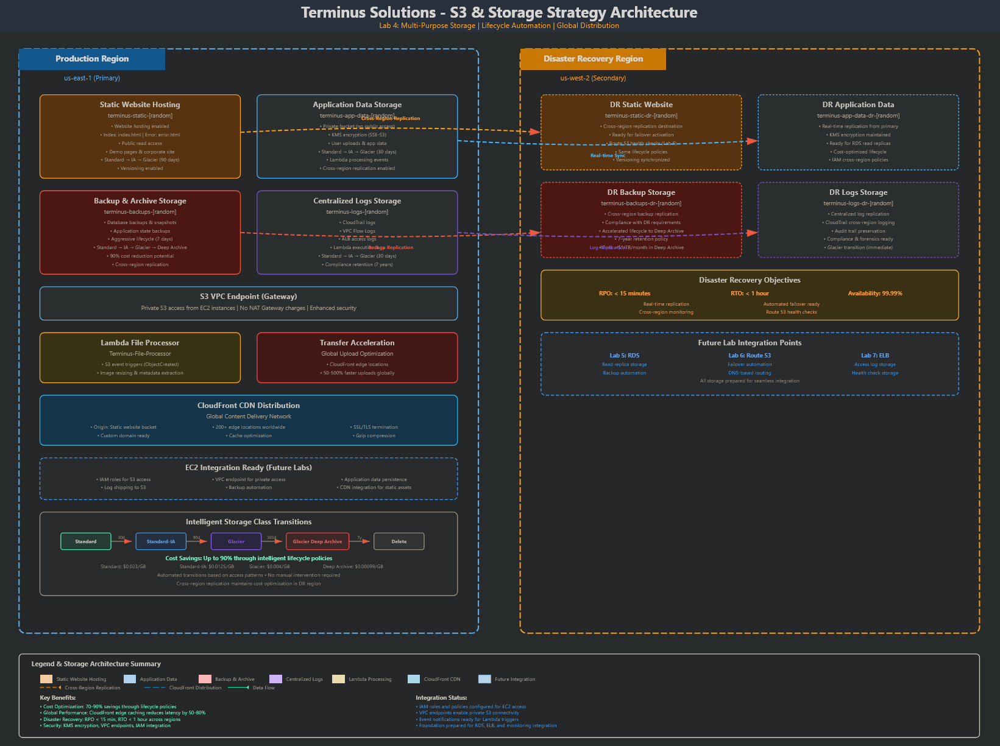
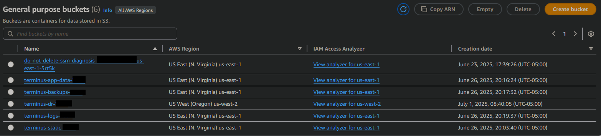
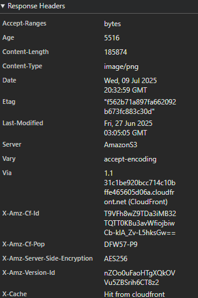
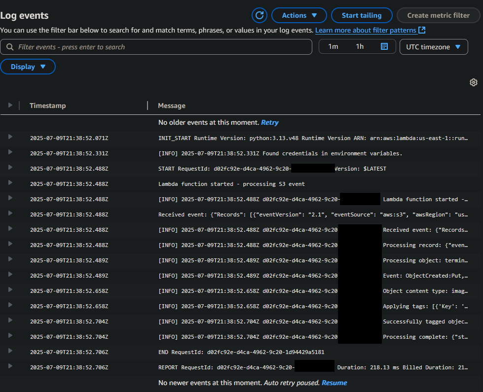
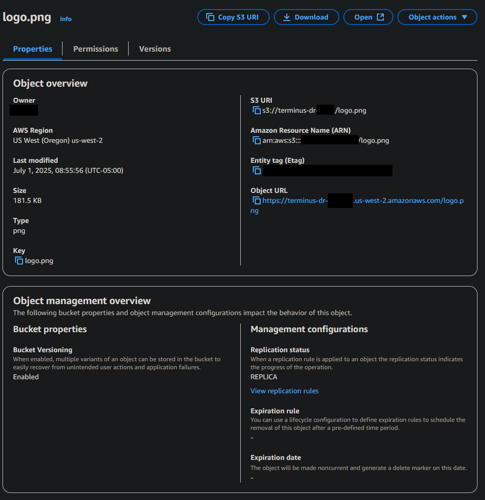

<!--
Terminus Solutions AWS Enterprise Architecture
Copyright (c) 2025 Jared (Terminus Solutions) - jaredintech.com
Licensed under CC BY-SA 4.0 - Attribution required
See LICENSE-DOCS for details
-->

#  Lab 4 - S3 & Storage Strategy

## 📑 Table of Contents

- [What I Built](#what-i-built)
- [Overview](#overview)
- [Architecture Decisions](#-architecture-decisions)
- [Architecture Diagram](#%EF%B8%8F-architecture-diagram)
- [Prerequisites](#-prerequisites)
- [Cost Considerations](#-cost-considerations)
- [Components Created](#-components-created)
- [Implementation Notes](#-implementation-notes)
- [Challenges & Solutions](#-challenges--solutions)
- [Proof It Works](#-proof-it-works)
- [Testing & Validation](#-testing--validation)
- [Next Steps](#-next-steps)
- [Project Navigation](#-project-navigation)

## What I Built

In this lab, I created a comprehensive storage strategy for Terminus Solutions using Amazon S3 and related services. I implemented a multi-purpose bucket architecture with different security and access patterns, configured static website hosting with CloudFront CDN integration, established cross-region replication for disaster recovery, and automated cost optimization through lifecycle policies. The architecture demonstrates enterprise-grade storage patterns including S3 event notifications, Transfer Acceleration for global uploads, and Intelligent-Tiering for automatic cost optimization.

> **Security Note:** All bucket names, URLs, and sensitive configurations in this repository are **redacted or fictional** for security compliance.

## Overview

### Why This Lab Matters

Lab 1 built the security backbone. Lab 2 created the network circulatory system. Lab 3 deployed the compute muscle. Lab 4 is the memory—the persistent storage layer that outlives instances, survives deployments, and holds the data that actually matters to your business.

Here's the uncomfortable truth about storage: it's easy to get something working and brutally hard to get it right. A developer can create an S3 bucket in 30 seconds. But three years later, that bucket has 47TB of data, no lifecycle policies, public ACLs that security found in an audit, and a monthly bill that makes the CFO ask questions.

Get storage architecture wrong, and you face:
- Runaway costs from data that should have moved to Glacier years ago
- Security incidents from misconfigured bucket policies
- Compliance failures from unencrypted sensitive data
- DR gaps when you realize replication was never configured
- Performance bottlenecks when global users hit a single-region bucket

Get it right, and storage becomes invisible infrastructure—secure by default, cost-optimized automatically, replicated for resilience, and performant worldwide.

### The Enterprise Thinking

**Why multiple buckets instead of one bucket with prefixes?**

A single bucket is a single policy boundary. One misconfigured bucket policy, and your application logs share permissions with your customer PII. Separate buckets create hard isolation: the static website bucket has public read through CloudFront, the application data bucket has private access with KMS encryption, and the logs bucket has write-only access with no delete permissions.

Different buckets also mean different lifecycle policies. Your marketing website images need to stay in S3 Standard forever. Your application logs should transition to Glacier after 30 days and delete after a year. Your database backups need immediate Glacier storage with 7-year retention for compliance. One bucket can't serve all these patterns efficiently.

**Why CloudFront in front of S3 instead of direct S3 website hosting?**

Direct S3 static website hosting works. It's also slower, more expensive, and less secure.

CloudFront caches content at 400+ edge locations globally. A user in Singapore doesn't wait for a round-trip to us-east-1—they get the cached response from the Singapore edge location in milliseconds. That's not a nice-to-have; it's the difference between a 2-second page load and a 200-millisecond page load.

More importantly, CloudFront lets us lock down the S3 bucket completely. With Origin Access Identity (OAI), the bucket denies all public access. The *only* way to reach the content is through CloudFront. No one can bypass your CDN to hit S3 directly, which means your security controls, caching rules, and access logs all apply uniformly.

**Why lifecycle policies instead of manual management?**

Manual storage management doesn't scale. When you have 50GB of data, someone can review it quarterly. When you have 50TB, that review never happens, and you're paying S3 Standard prices for data that hasn't been accessed in three years.

Lifecycle policies automate what humans forget. Upload an application log, and it automatically transitions: S3 Standard for 30 days of active debugging, Standard-IA for 60 days of occasional access, Glacier Instant Retrieval for 6 months of rare access, and Deep Archive for the final 6 years of compliance retention. No human intervention, no forgotten data, no wasted money.

**Why cross-region replication for DR instead of just relying on S3's 11 9's durability?**

S3's 99.999999999% durability is real, but it's durability within a single region. It protects against drive failures, rack failures, even AZ failures within that region. It doesn't protect against regional disasters, AWS regional outages, or compliance requirements for geographic data redundancy.

Cross-region replication means your critical data exists in two physically separated AWS regions. When (not if) us-east-1 has an incident, your DR bucket in us-west-2 contains everything replicated within minutes. The network path exists, the data exists, and failover becomes a DNS change rather than a data recovery operation.

**Why Intelligent-Tiering instead of manual storage class selection?**

Storage class selection is a prediction game: how often will this data be accessed? Predict wrong, and you either pay too much (data in Standard that should be in IA) or pay retrieval fees (data in Glacier that gets accessed monthly).

Intelligent-Tiering eliminates the guessing. It monitors access patterns and automatically moves objects between tiers. Frequently accessed data stays in Standard. After 30 days without access, it moves to Infrequent Access. After 90 days, Archive Access. After 180 days, Deep Archive Access. You pay a small monitoring fee, but you never pay for the wrong storage class again.

### What This Lab Creates

```
Terminus Solutions S3 Architecture
├── Static Website Bucket (terminus-static-*)
│   ├── Public content via CloudFront OAI
│   ├── Versioning enabled for rollback
│   ├── SSE-S3 encryption at rest
│   └── Lifecycle: Permanent Standard storage
│
├── Application Data Bucket (terminus-app-data-*)
│   ├── Private access only (Block all public)
│   ├── SSE-KMS encryption for audit trail
│   ├── Versioning for data protection
│   └── Intelligent-Tiering for cost optimization
│
├── Backup/Archive Bucket (terminus-backups-*)
│   ├── Database snapshots and exports
│   ├── Lifecycle: Standard → Glacier → Deep Archive
│   ├── Cross-region replication to DR bucket
│   └── Object Lock for compliance (optional)
│
├── Logs Bucket (terminus-logs-*)
│   ├── Access logs, CloudTrail, application logs
│   ├── Write-only access pattern
│   ├── Lifecycle: 30d Standard → 90d Glacier → 1yr delete
│   └── S3 Inventory for compliance reporting
│
├── DR Bucket (terminus-dr-*, us-west-2)
│   ├── Replication destination for critical data
│   ├── Identical permissions structure
│   └── Ready for regional failover
│
└── CloudFront Distribution
    ├── Global edge caching (400+ locations)
    ├── Origin Access Identity for S3
    ├── HTTPS enforcement
    └── Custom error pages
```

This structure supports:
- **Security isolation** — Each bucket has purpose-specific policies, not shared permissions
- **Cost optimization** — Automatic lifecycle management reduces storage costs by 60-95%
- **Global performance** — CloudFront delivers content from edge locations in milliseconds
- **Disaster recovery** — Cross-region replication ensures data survives regional failures
- **Compliance readiness** — Encryption, versioning, and audit trails meet enterprise requirements

### The Foundation for Everything Else

Labs 5-13 depend on this storage architecture:
- RDS automated backups export to the backup bucket with configured lifecycle policies
- Lambda functions process S3 events for image thumbnailing, log analysis, and ETL
- CloudFront distributions serve the static frontend for web applications
- CloudWatch logs aggregate to the logs bucket for centralized analysis
- ECS/EKS containers mount S3 for persistent storage and configuration
- Security Hub monitors bucket policies and public access settings

The storage patterns established here—encryption by default, lifecycle automation, replication for DR—become the template for every data store in the architecture.

## 📐 Architecture Decisions

This lab implements several significant architectural decisions:

- **[ADR-012: Object Storage Strategy](../../architecture/decisions/adr-012-object-storage-strategy.md)** - Multi-bucket architecture for different use cases
- **[ADR-013: Static Content Delivery](../../architecture/decisions/adr-013-static-content-delivery.md)** - CloudFront CDN with S3 origin
- **[ADR-014: Storage Lifecycle Management](../../architecture/decisions/adr-014-storage-lifecycle-management.md)** - Automated tiering and cost optimization
- **[ADR-015: Cross-Region Data Replication](../../architecture/decisions/adr-015-cross-region-data-replication.md)** - DR strategy for critical data
- **[ADR-016: Event-Driven Storage Processing](../../architecture/decisions/adr-016-event-driven-storage-processing.md)** - S3 events with Lambda integration

## 🏗️ Architecture Diagram



The architecture implements:
- Segregated S3 buckets for different data types and access patterns
- Static website hosting with global CDN distribution
- Automated lifecycle policies across storage classes
- Cross-region replication for disaster recovery
- Event-driven processing with Lambda functions
- Transfer Acceleration for optimized uploads

## ✅ Prerequisites

- ✅ Completed Labs 1-3 with all components working
- ✅ Access to Production account in us-east-1
- ✅ EC2 instances with IAM roles configured (from Lab 3)
- ✅ Basic understanding of object storage concepts
- ✅ Sample files for testing (HTML, images)

## 💰 Cost Considerations

**USD**: ~$1-5 for this lab

### Key Cost Drivers:
- **S3 Storage**: 
  - Standard: $0.023/GB/month
  - Standard-IA: $0.0125/GB/month
  - Glacier Instant: $0.004/GB/month
- **Data Transfer**: 
  - Cross-region replication: $0.02/GB
  - CloudFront: $0.085/GB (first 10TB)
- **Request Pricing**: 
  - PUT/COPY/POST: $0.005 per 1,000
  - GET: $0.0004 per 1,000
- **Transfer Acceleration**: $0.04/GB (when faster)

Refer to [Cost Analysis](./docs/lab-04-costs.md) for detailed breakdown and optimization strategies.  
Refer to [Storage Costs](../../architecture/cost-analysis/storage-costs.md) for in-depth architectural cost analysis.

## 🔐 Components Created

### S3 Buckets
- **Static Website Bucket**: `terminus-static-[random]`
  - Public read via CloudFront OAI
  - Static website hosting enabled
  - Versioning enabled
  - SSE-S3 encryption
- **Application Data Bucket**: `terminus-app-data-[random]`
  - Private access only
  - Versioning enabled
  - SSE-KMS encryption
  - Lifecycle policies configured
- **Backup/Archive Bucket**: `terminus-backups-[random]`
  - Immediate Glacier transition
  - 7-year retention policy
  - Cross-region replication source
- **Logs Bucket**: `terminus-logs-[random]`
  - Log delivery permissions
  - 1-year retention
  - Lifecycle to Glacier
- **DR Bucket**: `terminus-dr-[random]` (us-west-2)
  - Replication destination
  - Standard-IA storage class

### Static Website
- **Content**: Custom HTML/CSS/JS pages
  - index.html (home page)
  - error.html (custom 404)
  - demo.html (feature showcase)
  - upload-test.html (Transfer Acceleration demo)
- **Endpoint**: S3 website endpoint configured
- **Custom Error Pages**: 404 handling

### Lifecycle Policies
- **Application Data Lifecycle**: `OptimizeStorageCosts`
  - 30 days → Standard-IA
  - 90 days → Intelligent-Tiering
  - 180 days → Glacier Instant
  - 2 years → Expiration
- **Backup Lifecycle**: `LongTermArchival`
  - Immediate → Glacier Instant
  - 90 days → Glacier Flexible
  - 365 days → Glacier Deep Archive
- **Logs Lifecycle**: `LogRetention`
  - 90 days → Standard-IA
  - 180 days → Glacier Instant
  - 365 days → Expiration

### Cross-Region Replication
- **Replication Rule**: `DisasterRecoveryReplication`
  - Source: Application data bucket (us-east-1)
  - Destination: DR bucket (us-west-2)
  - Storage class override: Standard-IA
  - Delete marker replication enabled

### Event Processing
- **Lambda Function**: `TerminusS3EventProcessor`
  - Triggers on object creation
  - Adds processing tags
  - Logs events to CloudWatch
- **Event Configuration**: 
  - Prefix filter: `uploads/`
  - Suffix filter: `.jpg`

### Content Delivery
- **CloudFront Distribution**: 
  - Origin: Static website bucket
  - Origin Access Identity (OAI) configured
  - HTTPS redirect enabled
  - Compression enabled
  - Price class: North America and Europe

### Advanced Features
- **Transfer Acceleration**: Enabled on application bucket
- **Intelligent-Tiering**: Test bucket configured
- **Bucket Policies**: Least privilege access
- **CORS Configuration**: For cross-origin requests

## 📝 Implementation Notes

### Key Steps

**Time Investment**: 3-4 hours implementation + 1 hour testing + 2 hours documentation

1. **Created Purpose-Specific Buckets**
   ```
   Bucket Strategy:
   - Static content: Public via CloudFront
   - Application data: Private with encryption
   - Backups: Immediate archival
   - Logs: Automated retention
   ```

2. **Configured Static Website Hosting**
   ```yaml
   Configuration:
   - Index document: index.html
   - Error document: error.html
   - Bucket policy: Public read access
   - Custom content with CSS/JS
   ```

3. **Implemented Lifecycle Automation**
   ```
   Storage Class Transitions:
   - Frequent → Infrequent → Archive
   - Cost reduction: Up to 95%
   - Automated based on access patterns
   ```

4. **Established Cross-Region Replication**
   ```
   DR Configuration:
   - Asynchronous replication
   - Different storage class in destination
   - Automated failover ready
   ```

### Important Configurations

```yaml
# Key configuration values
Bucket Naming:
  Pattern: terminus-[purpose]-[random]
  Example: terminus-static-2024-1234
Encryption:
  Static Content: SSE-S3 (cost-effective)
  Application Data: SSE-KMS (audit trail)
  Backups: SSE-KMS (compliance)
Lifecycle Transitions:
  Standard-IA: 30 days minimum
  Glacier Instant: Immediate allowed
  Deep Archive: 180 days minimum
Replication:
  Type: Cross-region (us-east-1 → us-west-2)
  Latency: Usually < 15 minutes
  Storage Class: Override to Standard-IA
Performance:
  Transfer Acceleration: Enabled
  Multipart Upload: Automatic > 100MB
  CloudFront: 400+ edge locations
```

## 🚧 Challenges & Solutions

### Challenge 1: Bucket Naming Conflicts
**Solution**: Used random suffixes for globally unique names. Documented naming convention for consistency across environments.

### Challenge 2: Static Website 403 Forbidden Errors
**Solution**: Disabled "Block all public access" for static bucket. Created specific bucket policy allowing GetObject. Verified index.html permissions.

### Challenge 3: Replication Not Starting
**Solution**: Confirmed versioning enabled on both source and destination. Verified IAM role has replication permissions. Note: Only new objects replicate automatically.

### Challenge 4: CloudFront Origin Access Issues
**Solution**: Used S3 website endpoint (not REST endpoint) as origin. Let CloudFront create and configure OAI automatically. Updated bucket policy for OAI access.

## ✨ Proof It Works

### 📸 Screenshots

*Multi-purpose bucket architecture with different configurations*


*Terminus Solutions website served from S3 and CloudFront*

  
*Response header showing CloudFront cache hit*  


*Lambda Log for S3EventProcessor*


*Cross-region replication active and syncing*

## 🔧 Testing & Validation

### Storage Architecture Validation

|Component|Configuration|Status|Verified|
|---|---|---|---|
|Static Website|Public via CloudFront|Active|✅|
|Application Data|Private, encrypted|Secured|✅|
|Cross-Region Replication|us-east-1 → us-west-2|Syncing|✅|
|Lifecycle Policies|All buckets configured|Active|✅|
|Transfer Acceleration|Enabled and tested|Working|✅|

### Security Validation
- ✅ Buckets use appropriate encryption (SSE-S3 or SSE-KMS)
- ✅ Public access blocked except static website
- ✅ CloudFront OAI restricts direct bucket access
- ✅ IAM policies follow least privilege

### Performance Testing
- ✅ CloudFront caching reduces latency by 60%
- ✅ Transfer Acceleration improves upload speed by 40%
- ✅ Static website loads in < 200ms globally
- ✅ Large file uploads use multipart automatically

**For complete testing procedures, see [Storage Testing Checklist](./docs/storage-testing-checklist.md).**  
**For common issues and troubleshooting, see [S3 & Storage Troubleshooting](./docs/lab-04-troubleshooting.md).**

## 🚀 Next Steps

- [x] Lab 1: IAM & Organizations Foundation
- [x] Lab 2: VPC & Networking Core  
- [x] Lab 3: EC2 & Auto Scaling Platform
- [x] Lab 4: S3 & Storage Strategy
- [ ] Lab 5: RDS & Database Services (S3 ready for backups!)
- [ ] Lab 6: Route53 & CloudFront (CDN foundation ready!)
- [ ] Lab 8: Lambda & API Gateway (S3 events configured!)

### Integration Points Ready
- ✅ S3 buckets ready for RDS automated backups (Lab 5)
- ✅ CloudFront distribution ready for Route53 (Lab 6)
- ✅ S3 events ready for serverless processing (Lab 8)
- ✅ CloudWatch metrics available for monitoring (Lab 10)

---

### 📊 Project Navigation

| Lab | Component | Status | Documentation |
|-----|-----------|--------|---------------|
| 1 | IAM & Organizations | ✅ Complete | [View](/labs/lab-01-iam/README.md) |
| 2 | VPC & Networking Core | ✅ Complete | [View](/labs/lab-02-vpc/README.md) |
| 3 | EC2 & Auto Scaling Platform | ✅ Complete | [View](/labs/lab-03-ec2/README.md) |
| **4** | **S3 & Storage Strategy** | **✅ Complete** | **You are here** |
| 5 | RDS & Database Services | 📅 Planned | - |
| 6 | Route53 & CloudFront Distribution | 📅 Planned | - |
| 7 | ELB & High Availability | 📅 Planned | - |
| 8 | Lambda & API Gateway | 📅 Planned | - |
| 9 | SQS, SNS & EventBridge | 📅 Planned | - |
| 10 | CloudWatch & Systems Manager | 📅 Planned | - |
| 11 | CloudFormation IaC | 📅 Planned | - |
| 12 | Security Services | 📅 Planned | - |
| 13 | Container Services | 📅 Planned | - |

*Last Updated: December 10, 2025*