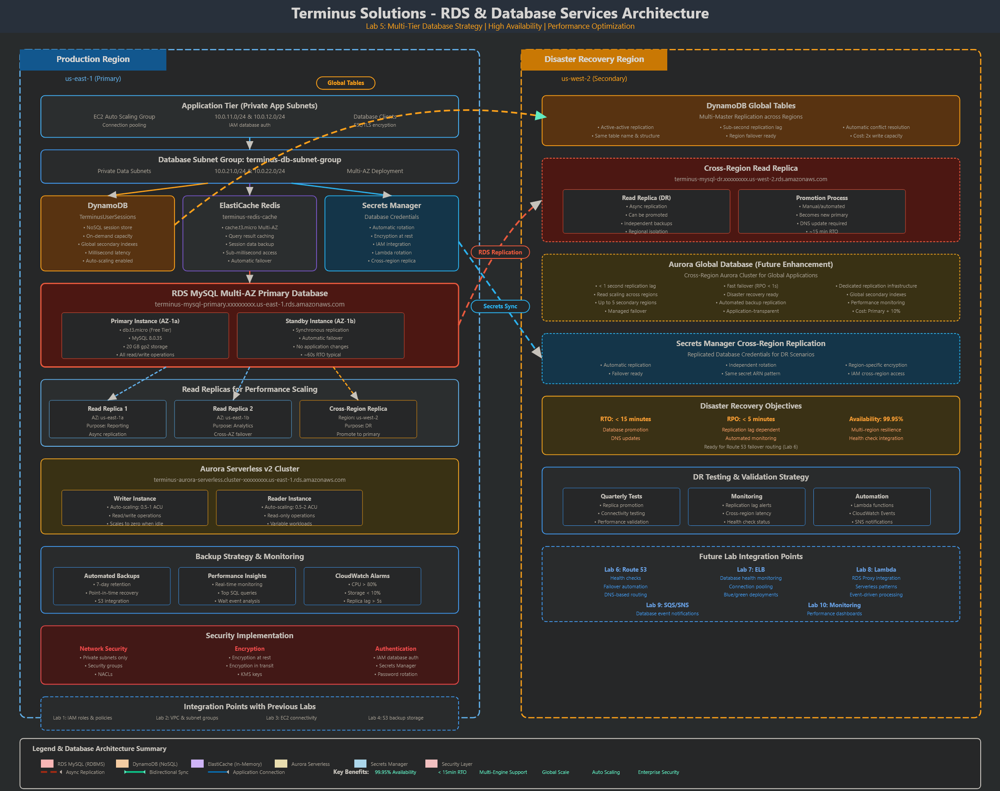
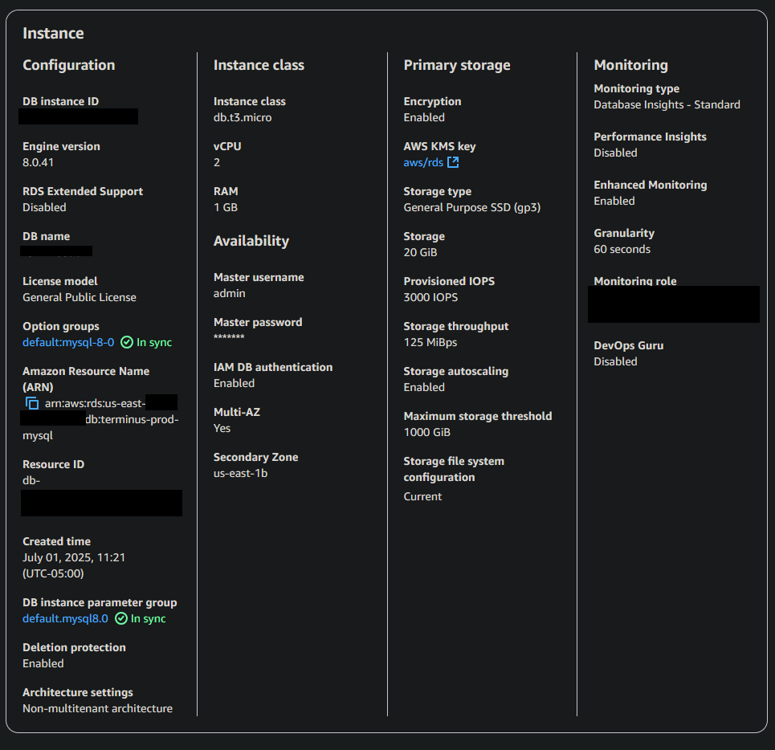
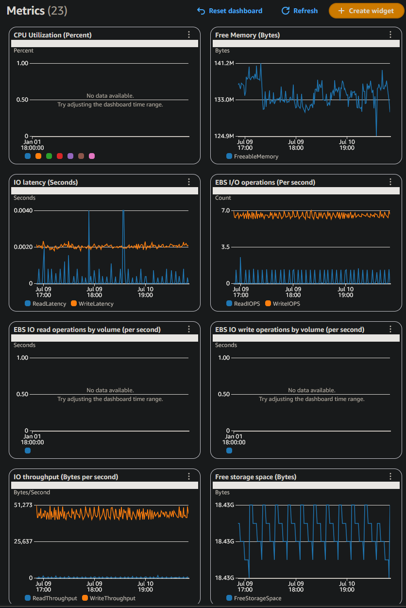
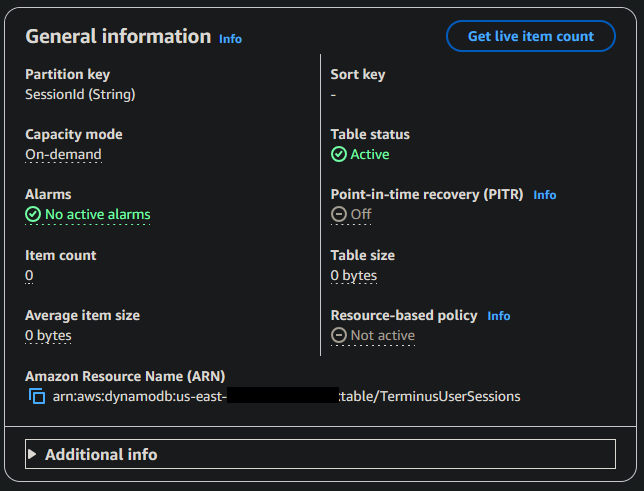

<!--
Terminus Solutions AWS Enterprise Architecture
Copyright (c) 2025 Jared (Terminus Solutions) - jaredintech.com
Licensed under CC BY-SA 4.0 - Attribution required
See LICENSE-DOCS for details
-->

#  Lab 5 - RDS & Database Services

## 📑 Table of Contents

- [What I Built](#what-i-built)
- [Overview](#overview)
- [Architecture Decisions](#-architecture-decisions)
- [Architecture Diagram](#-architecture-diagram)
- [Prerequisites](#-prerequisites)
- [Cost Considerations](#-cost-considerations)
- [Components Created](#-components-created)
- [Implementation Notes](#-implementation-notes)
- [Challenges & Solutions](#-challenges--solutions)
- [Proof It Works](#-proof-it-works)
- [Testing & Validation](#-testing--validation)
- [Next Steps](#-next-steps)
- [Project Navigation](#-project-navigation)

## What I Built

In this lab, I created a comprehensive database infrastructure for Terminus Solutions using Amazon RDS, Aurora, DynamoDB, and ElastiCache. I implemented a Multi-AZ RDS MySQL deployment for high availability, configured read replicas for performance scaling including cross-region DR, deployed Aurora Serverless v2 for variable workloads, and integrated DynamoDB for session management. The architecture demonstrates enterprise-grade database patterns with automated backups, IAM authentication, Secrets Manager integration, and comprehensive monitoring through Performance Insights.

> **Security Note:** All database endpoints, credentials, and sensitive configurations in this repository are **redacted or fictional** for security compliance.

## Overview

### Why This Lab Matters

Lab 1 built the security backbone. Lab 2 created the circulatory system. Lab 3 deployed the compute muscle. Lab 4 established the memory. Lab 5 is the brain—the database layer where your business logic lives, your transactions happen, and your most valuable asset (data) resides.

Here's what most teams don't understand about databases until it's too late: your compute can fail and recover in minutes, your storage can replicate automatically, but a corrupted database or lost transaction is a business-ending event. When a database goes down during peak traffic, every second costs money, reputation, and customer trust.

The gap between "I spun up an RDS instance" and "I have enterprise-grade database infrastructure" is enormous. A developer can launch a single-AZ MySQL instance in ten minutes. But that instance has no failover, no read scaling, no automated credential rotation, and backups that may or may not work when you desperately need them.

Get database architecture wrong, and you face:
- Extended downtime during AZ failures (no Multi-AZ means no automatic failover)
- Performance degradation as read traffic overwhelms your primary instance
- Security incidents from hardcoded credentials or unencrypted connections
- Data loss from inadequate backup strategies
- Compliance failures from missing audit trails
- Runaway costs from over-provisioned instances that can't scale down

Get it right, and your database layer becomes invisible infrastructure—always available, automatically scaling, secure by default, and self-healing when problems occur.

### The Enterprise Thinking

**Why Multi-AZ deployment instead of single-AZ?**

Single-AZ is a bet that your Availability Zone won't fail. It's a bet you'll lose eventually.

Multi-AZ RDS maintains a synchronous standby replica in a different Availability Zone. When the primary fails—hardware issue, AZ outage, maintenance window—RDS automatically promotes the standby within 60-120 seconds. No data loss (synchronous replication), no manual intervention, no 3 AM phone calls.

The cost is roughly double the compute. The value is business continuity. A four-hour outage during peak traffic costs more than years of Multi-AZ premiums. The CFO who questions the Multi-AZ cost hasn't calculated the revenue impact of a database failure during Black Friday.

**Why managed databases (RDS/Aurora) instead of self-managed on EC2?**

You can run MySQL on EC2. Companies did it for years. They also employed full-time DBAs, maintained replication scripts, built custom backup solutions, handled security patching, and lost sleep over failover procedures.

RDS handles all of this. Automated backups, automatic minor version upgrades, one-click read replicas, push-button Multi-AZ, integrated monitoring, and failover that just works. The managed service costs slightly more per hour than raw EC2, but saves thousands in operational overhead.

The hidden cost of self-managed databases isn't the compute—it's the engineering time spent on undifferentiated heavy lifting. Every hour your team spends managing MySQL replication is an hour not spent building features customers pay for.

**Why read replicas instead of vertical scaling?**

Vertical scaling (bigger instance) has hard limits. You can't buy a db.r5.48xlarge when you need more than what db.r5.24xlarge provides. More importantly, vertical scaling means downtime—you can't resize a running instance without a reboot.

Read replicas scale horizontally. Add two replicas and triple your read capacity. Add ten replicas and your reporting queries never touch production. Replicas can live in different AZs for resilience or different regions for geographic distribution.

The pattern is simple: writes go to the primary, reads distribute across replicas. Your application connection logic handles the routing, or you use RDS Proxy to manage it automatically. When traffic spikes, add replicas. When it drops, remove them. No downtime, no instance resizing, no bets on future capacity.

**Why purpose-built databases instead of one database for everything?**

The relational database was invented in 1970. It's excellent for structured data with relationships, transactions, and complex queries. It's mediocre for session storage, terrible for caching, and expensive for simple key-value lookups.

DynamoDB handles session management with single-digit millisecond latency at any scale. ElastiCache puts frequently-accessed query results in memory, reducing database load by 75% or more. Aurora Serverless handles variable workloads without paying for idle capacity.

Each purpose-built database optimizes for specific access patterns:
- RDS MySQL: Transactional workloads with complex relationships
- DynamoDB: High-velocity key-value operations with global replication
- ElastiCache: Sub-millisecond response times for repeated queries
- Aurora Serverless: Variable workloads that can scale to zero

Using a single database for all workloads is like using a hammer for everything—technically possible, practically inefficient. The complexity of managing multiple database types is far less than the cost of forcing a relational database to handle workloads it wasn't designed for.

**Why Secrets Manager instead of application-stored credentials?**

Somewhere in production, there's a database password in an environment variable that was set two years ago. Nobody remembers what it is. Nobody wants to rotate it because "what if something breaks?" It's probably in a git commit somewhere from when the junior developer accidentally pushed .env to the repository.

Secrets Manager eliminates this entire category of problem. Credentials live in a secure vault, automatically rotate on schedule, and applications retrieve them at runtime. When rotation happens, the database gets the new password, the secret gets the new value, and applications never know the difference.

The security benefit is obvious—no hardcoded credentials means no credential leaks. The operational benefit is underrated—when you need to rotate passwords (security incident, employee departure, compliance requirement), it's a single API call instead of a coordinated deployment across every application that touches the database.

## 📐 Architecture Decisions

This lab implements several significant architectural decisions:

- **[ADR-017: Database Platform Strategy](../../architecture/decisions/adr-017-database-platform-strategy.md)** - RDS vs Aurora vs DynamoDB selection criteria
- **[ADR-018: High Availability Database Design](../../architecture/decisions/adr-018-high-availability-database-design.md)** - Multi-AZ and read replica architecture
- **[ADR-019: Database Security Framework](../../architecture/decisions/adr-019-database-security-framework.md)** - IAM authentication and encryption approach
- **[ADR-020: Caching Strategy](../../architecture/decisions/adr-020-caching-strategy.md)** - ElastiCache integration for performance
- **[ADR-021: Database Backup and Recovery](../../architecture/decisions/adr-021-database-backup-recovery.md)** - Automated backups and cross-region replication

## 🏗️ Architecture Diagram



The architecture implements:
- Multi-AZ RDS MySQL for primary transactional workloads
- Read replicas distributed across AZs and regions
- Aurora Serverless v2 for auto-scaling database capacity
- DynamoDB for session state and real-time data
- ElastiCache Redis for query caching
- Secrets Manager for automated credential rotation
- Performance Insights for database monitoring

## ✅ Prerequisites

- ✅ Completed Labs 1-4 with all components working
- ✅ VPC with database subnets configured (from Lab 2)
- ✅ EC2 instances running for connectivity testing (from Lab 3)
- ✅ Security groups properly configured
- ✅ Basic understanding of relational database concepts
- ✅ MySQL client available (local or on EC2)

## 💰 Cost Considerations

**USD**: ~$10-20 for this lab (RDS instances incur charges even when stopped)

### Key Cost Drivers:
- **RDS MySQL Multi-AZ**: 
  - db.t3.micro: ~$0.034/hour ($25/month)
  - Storage: 20GB gp3 at $0.115/GB/month
- **Read Replicas**: 
  - 2 regional replicas: ~$0.017/hour each
  - 1 cross-region replica: +$0.02/GB transfer
- **Aurora Serverless v2**: 
  - 0.5-1 ACU: ~$0.12/ACU/hour
  - Scales to zero when idle
- **DynamoDB**: 
  - On-demand: $0.25/million reads/writes
  - Global table replication: 2x cost
- **ElastiCache**: 
  - cache.t3.micro: ~$0.017/hour

Refer to [Cost Analysis](./docs/lab-05-costs.md) for detailed breakdown and optimization strategies.

## 🔐 Components Created

### Database Infrastructure
- **DB Subnet Group**: `terminus-db-subnet-group`
  - Spans 2 AZs for Multi-AZ deployment
  - Uses private data subnets from Lab 2
- **RDS MySQL Instance**: `terminus-prod-mysql`
  - Multi-AZ deployment with synchronous standby
  - MySQL 8.0 latest version
  - 20GB gp3 storage with autoscaling to 100GB
  - Automated backups with 7-day retention
  - Cross-region backup replication to us-west-2
- **Read Replicas**:
  - `terminus-mysql-read-1` (us-east-1a)
  - `terminus-mysql-dr-replica` (us-west-2)

### Aurora Infrastructure
- **Aurora Serverless v2 Cluster**: `terminus-aurora-serverless`
  - MySQL 8.0 compatible
  - 0.5-1 ACU capacity range
  - Auto-pause after inactivity
  - Encryption at rest

### NoSQL and Caching
- **DynamoDB Table**: `TerminusUserSessions`
  - On-demand billing mode
  - Global table with us-west-2 replica
  - TTL enabled on ExpirationTime attribute
- **ElastiCache Redis**: `terminus-redis-cache`
  - cache.t3.micro with 1 replica
  - Encryption in transit and at rest
  - Cluster mode disabled

### Security Components
- **Security Groups**:
  - `terminus-rds-mysql-sg` - MySQL access from app tier
  - `terminus-aurora-sg` - Aurora cluster access
  - `terminus-elasticache-sg` - Redis access control
- **IAM Components**:
  - IAM database authentication enabled
  - `TerminusRDSIAMAuthPolicy` - Database access policy
  - Database activity logging to CloudWatch
- **Secrets Manager**:
  - `terminus/rds/mysql/master` - Master credentials
  - Automatic rotation every 30 days
  - Lambda function for rotation

### Monitoring and Performance
- **Performance Insights**: Enabled with 7-day retention
- **Enhanced Monitoring**: 60-second granularity
- **CloudWatch Log Groups**:
  - Error logs
  - Slow query logs
- **CloudWatch Alarms**:
  - CPU > 80%
  - Storage < 10%
  - Replica lag > 5 seconds

## 📝 Implementation Notes

### Key Steps

**Time Investment**: 4-5 hours implementation + 1 hour testing + 2 hours documentation

1. **Created Database Network Foundation**
   ```yaml
   DB Subnet Group:
   - Private data subnets only
   - No internet routing (security)
   - Multi-AZ coverage required
   ```

2. **Deployed Multi-AZ RDS MySQL**
   ```
   High Availability Features:
   - Synchronous standby in different AZ
   - Automatic failover in 60-120 seconds
   - Zero data loss (synchronous replication)
   ```

3. **Configured Read Replicas**
   ```
   Performance Scaling:
   - Asynchronous replication
   - Separate endpoints for read traffic
   - Cross-region replica for DR
   ```

4. **Implemented Security Layers**
   ```
   Defense in Depth:
   - Network isolation (private subnets)
   - Encryption at rest and in transit
   - IAM authentication option
   - Automated credential rotation
   ```

### Important Configurations

```yaml
# Key configuration values
RDS MySQL:
  Engine: MySQL 8.0.35
  Instance: db.t3.micro (burstable)
  Storage: 20GB gp3 (3000 IOPS baseline)
  Multi-AZ: Enabled
  Backup: 7 days retention + cross-region
  Encryption: AWS managed keys

Aurora Serverless v2:
  Min Capacity: 0.5 ACU
  Max Capacity: 1 ACU
  Auto-pause: After 5 minutes idle
  
DynamoDB:
  Billing: On-demand
  Global Tables: us-east-1, us-west-2
  Consistency: Eventually consistent
  
ElastiCache:
  Engine: Redis 7.0
  Node Type: cache.t3.micro
  Replicas: 1 (for HA)
  
Monitoring:
  Performance Insights: 7 days
  Enhanced Monitoring: 60 seconds
  Backup Window: 03:00-04:00 UTC
```

## 🚧 Challenges & Solutions

### Challenge 1: IAM Database Authentication Setup
**Solution**: Created specific IAM policy with correct resource ARN format. Tested token generation from EC2 instance. Note: Tokens expire after 15 minutes.

### Challenge 2: Cross-Region Read Replica Network
**Solution**: Ensured security groups in us-west-2 allow traffic from us-east-1 CIDR ranges. Verified VPC peering routes are configured.

### Challenge 3: Aurora Serverless Cold Starts
**Solution**: Set minimum capacity to 0.5 ACU to reduce cold start time. For production, consider keeping minimum at 1 ACU.

### Challenge 4: Secrets Manager Rotation Function
**Solution**: Ensured Lambda function has network path to RDS (same VPC). Added VPC endpoint for Secrets Manager to avoid internet routing.

## ✨ Proof It Works

### 🧪 Test Results
```bash
# RDS Multi-AZ failover test
$ aws rds reboot-db-instance \
    --db-instance-identifier terminus-prod-mysql \
    --force-failover

Failover completed in: 87 seconds
Application impact: Minimal (connection retry handled)

# Read replica lag monitoring
Primary write time: 10:45:00
Replica 1 sync: 10:45:01 (1 second lag)
Cross-region sync: 10:45:03 (3 second lag)

# DynamoDB global table test
Item written to us-east-1: 10:50:00
Item readable in us-west-2: 10:50:02
Replication lag: ~2 seconds
```

### 📸 Screenshots
  
*Multi-AZ RDS deployment with automatic failover*  

  
*Database performance metrics and query analysis*  

  
*DynamoDB configuration*  

## 🔧 Testing & Validation

### Database Connectivity Tests

|Test Scenario|Expected Result|Actual Result|Status|
|---|---|---|---|
|Connect from App Server|Successful connection|Connected via mysql client|✅ Pass|
|IAM Authentication|Token-based login works|Authenticated successfully|✅ Pass|
|Failover Test|<2 minute recovery|87 second failover|✅ Pass|
|Read Replica Lag|<5 seconds|1-3 seconds observed|✅ Pass|
|Cross-region Replication|Data synchronized|Working with 3s lag|✅ Pass|

### Security Validation
- ✅ Databases in private subnets (no internet access)
- ✅ Encryption at rest enabled for all databases
- ✅ SSL/TLS enforced for connections
- ✅ Secrets Manager rotating credentials
- ✅ IAM authentication working alongside password auth

### Performance Testing
- ✅ ElastiCache reducing query response time by 75%
- ✅ Read replicas handling reporting queries
- ✅ Aurora Serverless scaling with load
- ✅ DynamoDB sub-millisecond response times

**For complete testing procedures, see [Database Testing Checklist](./docs/database-testing-checklist.md).**  
**For common issues and troubleshooting, see [RDS & Database Troubleshooting](./docs/lab-05-troubleshooting.md).**

## 🚀 Next Steps

- [x] Lab 1: IAM & Organizations Foundation
- [x] Lab 2: VPC & Networking Core  
- [x] Lab 3: EC2 & Auto Scaling Platform
- [x] Lab 4: S3 & Storage Strategy
- [x] Lab 5: RDS & Database Services
- [ ] Lab 6: Route53 & CloudFront (Database endpoints ready!)
- [ ] Lab 7: ELB & High Availability (Health checks include DB!)
- [ ] Lab 8: Lambda & API Gateway (RDS Proxy integration!)

### Integration Points Ready
- ✅ Database backups configured for S3 storage
- ✅ Read replica endpoints ready for Route53 routing
- ✅ Health check queries defined for load balancers
- ✅ IAM roles prepared for Lambda RDS access
- ✅ CloudWatch metrics available for monitoring dashboards

---

### 📊 Project Navigation

| Lab | Component | Status | Documentation |
|-----|-----------|--------|---------------|
| 1 | IAM & Organizations | ✅ Complete | [View](/labs/lab-01-iam/README.md) |
| 2 | VPC & Networking Core | ✅ Complete | [View](/labs/lab-02-vpc/README.md) |
| 3 | EC2 & Auto Scaling Platform | ✅ Complete | [View](/labs/lab-03-ec2/README.md) |
| 4 | S3 & Storage Strategy | ✅ Complete | [View](/labs/lab-04-s3/README.md) |
| **5** | **RDS & Database Services** | **✅ Complete** | **You are here** |
| 6 | Route53 & CloudFront Distribution | ✅ Complete | [View](/labs/lab-06-route53-cloudfront/README.md) |
| 7 | ELB & High Availability | 📅 Planned | - |
| 8 | Lambda & API Gateway | 📅 Planned | - |
| 9 | SQS, SNS & EventBridge | 📅 Planned | - |
| 10 | CloudWatch & Systems Manager | 📅 Planned | - |
| 11 | CloudFormation IaC | 📅 Planned | - |
| 12 | Security Services | 📅 Planned | - |
| 13 | Container Services | 📅 Planned | - |

---

*Lab Status: ✅ Complete*  
*Last Updated: December 22, 2025*