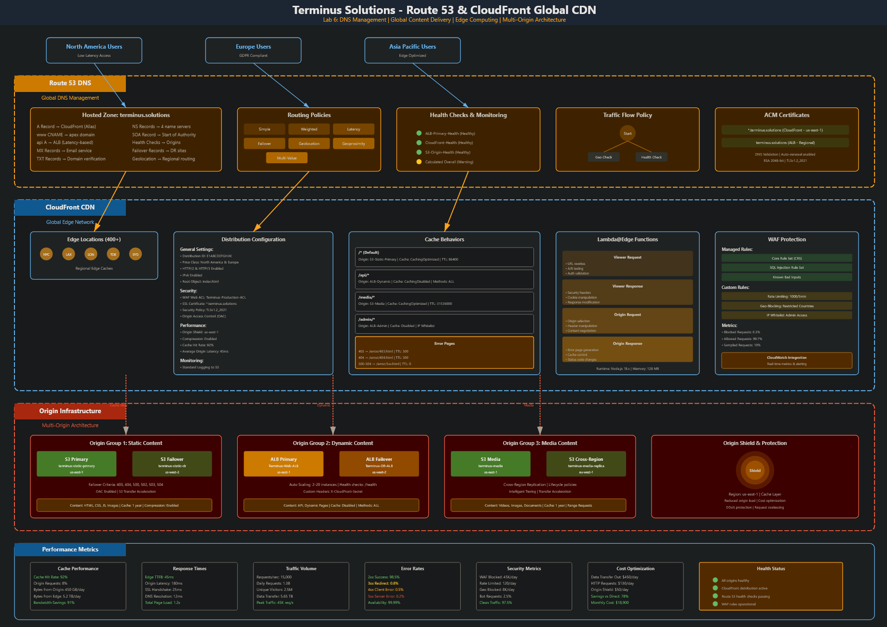
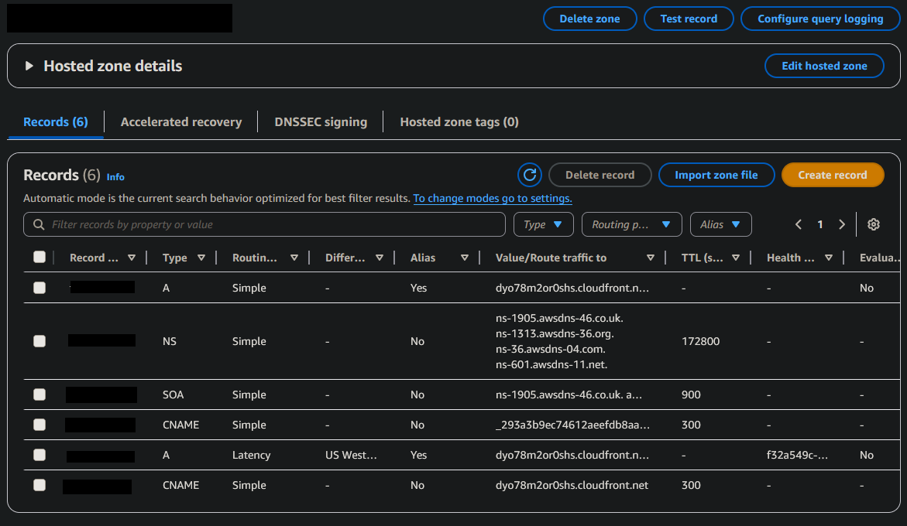
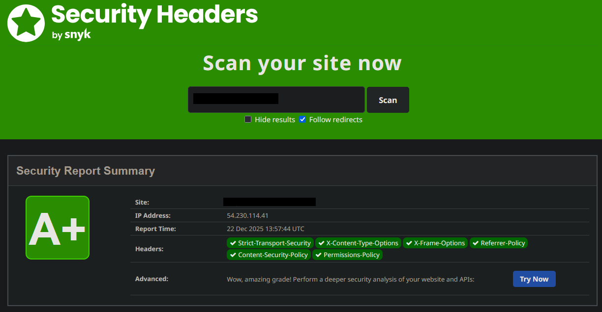

<!--
Terminus Solutions AWS Enterprise Architecture
Copyright (c) 2025 Jared (Terminus Solutions) - jaredintech.com
Licensed under CC BY-SA 4.0 - Attribution required
See LICENSE-DOCS for details
-->

#  Lab 6 - Route 53 & CloudFront Distribution

## 📑 Table of Contents

- [What I Built](#what-i-built)
- [Overview](#overview)
- [Architecture Decisions](#-architecture-decisions)
- [Architecture Diagram](#-architecture-diagram)
- [Prerequisites](#-prerequisites)
- [Cost Considerations](#-cost-considerations)
- [Components Created](#-components-created)
- [Implementation Notes](#-implementation-notes)
- [Challenges & Solutions](#-challenges--solutions)
- [Proof It Works](#-proof-it-works)
- [Testing & Validation](#-testing--validation)
- [Next Steps](#-next-steps)
- [Project Navigation](#-project-navigation)

## What I Built

In this lab, I created a global content delivery network for Terminus Solutions using Amazon CloudFront and Route 53. I implemented a production-grade CDN with multiple origins, intelligent DNS routing with health checks, automatic origin failover for high availability, and edge security with AWS WAF. The architecture demonstrates enterprise patterns for global content delivery including Lambda@Edge functions, SSL/TLS certificate management, and comprehensive monitoring.

> **Security Note:** All domain names, CloudFront distribution IDs, and sensitive configurations in this repository are **redacted or fictional** for security compliance.

## Overview

### Why This Lab Matters

Lab 1 built the security backbone. Lab 2 created the circulatory system. Lab 3 deployed the compute muscle. Lab 4 established the memory. Lab 5 implemented the brain. Lab 6 is the nervous system—the global infrastructure that connects users worldwide to your application with speed, reliability, and intelligence.

Here's what most teams don't understand about DNS and content delivery until a user in Singapore complains about 3-second page loads: performance at the edge isn't optional for global applications. Your application can be perfectly architected in us-east-1, but if every request from Asia requires a round-trip across the Pacific, user experience suffers regardless of how well you've optimized everything else.

The gap between "I pointed my domain at a load balancer" and "I have enterprise-grade global content delivery" is enormous. A developer can create a Route 53 record in two minutes. But that record has no health checks, no failover, no intelligent routing—when your primary region fails, your entire application is unreachable even if DR infrastructure is ready and waiting.

Get DNS and CDN architecture wrong, and you face:
- Latency complaints from global users hitting single-region infrastructure
- Complete outages when DNS doesn't fail over to healthy endpoints
- Security incidents from DDoS attacks hitting your origin directly
- Cost overruns from uncached content hitting your origin for every request
- SSL/TLS certificate expirations taking down production at 2 AM
- Compliance failures from missing security headers or geographic restrictions

Get it right, and your global infrastructure becomes invisible to users—sub-100ms response times worldwide, automatic failover that users never notice, edge security that stops attacks before they reach your origin, and cost optimization that scales efficiently with traffic.

### The Enterprise Thinking

**Why Route 53 instead of an external DNS provider?**

External DNS providers work. Many enterprises used them for years. But they create an operational gap—your infrastructure is in AWS, your monitoring is in AWS, your failover logic needs to be in AWS, but your DNS is somewhere else with its own console, its own API, its own failure modes.

Route 53 provides native integration that external providers can't match. Health checks tie directly to CloudWatch. Failover routing activates based on actual endpoint health, not DNS TTL delays. Latency-based routing uses AWS's global network intelligence. Alias records avoid the extra DNS lookup that CNAME records require.

More importantly, Route 53's 100% SLA for DNS queries means your domain resolution isn't a single point of failure. When you're building infrastructure that needs to survive regional AWS outages, having DNS on a separate global infrastructure (Route 53 runs on AWS's anycast network, not in any single region) is a prerequisite, not a nice-to-have.

**Why CloudFront instead of serving directly from the origin?**

Serving directly from your origin works for development. It fails at scale for three reasons: performance, cost, and security.

Performance: Your ALB in us-east-1 is ~150ms away from users in Sydney. CloudFront's Sydney edge location is ~20ms away. That difference compounds across every asset on your page. A direct connection might load in 3 seconds; CloudFront delivers in 500ms.

Cost: Data transfer from EC2 to the internet costs $0.09/GB. Data transfer from CloudFront to the internet costs as low as $0.02/GB (depending on price class and volume). When you're serving terabytes of content, CDN isn't a performance feature—it's a cost optimization.

Security: Your origin shouldn't be directly addressable from the internet. Every request hitting your ALB directly is a potential attack vector. CloudFront acts as a reverse proxy—the internet sees CloudFront, your origin only accepts traffic from CloudFront. Add WAF at the edge, and you're stopping attacks before they consume your origin's resources.

**Why Origin Access Control instead of public S3 buckets?**

Public S3 buckets are a compliance finding waiting to happen. They appear in security scans, they're listed in AWS's public bucket inventories, and they bypass all your CloudFront security controls if someone discovers the direct URL.

Origin Access Control (OAC) creates a trust relationship between CloudFront and S3. The bucket remains completely private—no public access. CloudFront signs requests using AWS Signature Version 4. S3 validates the signature and serves content only to CloudFront.

The practical impact: users can only access your content through CloudFront. All your caching rules apply. All your WAF rules apply. All your geographic restrictions apply. There's no back door to your content.

**Why health checks and failover instead of simple routing?**

Simple DNS routing is a bet that your primary endpoint will never fail. You'll lose that bet during your next regional outage.

Route 53 health checks actively monitor your endpoints every 10-30 seconds from multiple global locations. When a health check fails, Route 53 automatically routes traffic to healthy endpoints. This happens at DNS resolution time—users get IPs for working infrastructure without waiting for manual intervention.

The key insight is that health checks should monitor what users actually experience. A health check that pings your ALB only tells you the ALB is responding. A health check that requests your application's /health endpoint through CloudFront tells you the entire stack is functional. Configure your health checks to reflect real user experience.

**Why multiple routing policies (latency, geolocation, failover)?**

Different traffic needs different routing logic. Not understanding this is how you end up with GDPR violations, poor user experience, and unnecessary cross-region data transfer costs.

Latency-based routing sends users to the nearest healthy endpoint. A user in Frankfurt reaches your eu-west-1 infrastructure; a user in Tokyo reaches ap-northeast-1. This isn't about compliance—it's about physics. Light travels at finite speed, and every millisecond of latency costs engagement.

Geolocation routing sends users from specific locations to specific endpoints regardless of latency. When GDPR requires EU user data to stay in EU regions, or when you have region-specific content, geolocation routing enforces those requirements at the DNS layer.

Failover routing ensures continuity when primary endpoints fail. Your primary region handles traffic until health checks fail, then traffic shifts to DR automatically. When primary recovers, traffic shifts back without manual intervention.

These policies combine. Latency-based routing selects the region; failover within that region selects the healthy endpoint. The result is traffic that's always optimal and always available.

**Why WAF at the edge instead of just at the origin?**

WAF at the origin stops attacks—but only after those attacks have traversed your entire network path, consumed CloudFront's bandwidth, and reached your infrastructure. Every blocked request at the origin still costs you data transfer.

WAF at the edge stops attacks at the first point of contact. SQL injection attempts from Brazil get blocked at the São Paulo edge location before they cross the internet to your origin. Bot traffic gets stopped before it consumes resources. Rate limiting happens globally, not per-region.

The financial case is compelling: blocking 1 million malicious requests at the edge costs WAF inspection fees. Letting those requests reach your origin costs data transfer, ALB processing, and compute time even if you eventually block them.

**Why Lambda@Edge for security headers?**

Security headers (Content-Security-Policy, X-Frame-Options, Strict-Transport-Security) should be present on every response. You can configure them at the origin—in your ALB, in your application code, in S3 metadata. But that means configuring them in multiple places, hoping they stay synchronized, and troubleshooting when they don't.

Lambda@Edge lets you inject headers at the CloudFront layer. Every response, regardless of origin, gets consistent security headers. Configuration lives in one place. Updates propagate globally in minutes. You can add headers that your origin can't set (or override headers it sets incorrectly).

The operational simplicity outweighs the additional complexity. Security headers are a cross-cutting concern; implement them at a cross-cutting layer.

## 📐 Architecture Decisions

This lab implements several significant architectural decisions:

- **[ADR-022: Global Content Delivery Strategy](../../architecture/decisions/adr-022-global-content-delivery-strategy.md)** - Multi-origin CloudFront architecture with intelligent caching
- **[ADR-023: DNS Management and Routing](../../architecture/decisions/adr-023-dns-management-routing.md)** - Route 53 routing policies for performance and availability
- **[ADR-024: Edge Security Implementation](../../architecture/decisions/adr-024-edge-security-implementation.md)** - WAF and Lambda@Edge for security at the edge
- **[ADR-025: SSL/TLS Certificate Strategy](../../architecture/decisions/adr-025-ssl-tls-certificate-strategy.md)** - Certificate management across regions and services
- **[ADR-026: CDN High Availability Design](../../architecture/decisions/adr-026-cdn-high-availability-design.md)** - Origin failover and health check strategies

## 🏗️ Architecture Diagram



The architecture implements a globally distributed content delivery network with Route 53 providing intelligent DNS routing to CloudFront edge locations worldwide. CloudFront serves static content from S3 origins (secured with OAC), dynamic content from ALB origins, and provides automatic failover through origin groups. AWS WAF protects at the edge, Lambda@Edge adds security headers, and comprehensive health checks enable automated failover between regions.

## ✅ Prerequisites

- ✅ Completed Lab 1 (IAM & Organizations) with cross-account access working
- ✅ Completed Lab 2 (VPC & Networking) with all subnets and security groups configured
- ✅ Completed Lab 3 (EC2 & Auto Scaling) with ALB configured for origin integration
- ✅ Completed Lab 4 (S3 & Storage) with static content bucket ready for CloudFront
- ✅ Completed Lab 5 (RDS & Database) with application tier ready
- ✅ Domain name registered (or access to DNS management for existing domain)
- ✅ Basic understanding of DNS concepts (A records, CNAME, TTL)

## 💰 Cost Considerations

**Estimated Monthly Cost**: ~$15-25 (varies with traffic volume)

### Key Cost Drivers:
- **Route 53 Hosted Zone**: $0.50/month per hosted zone
- **Route 53 Queries**: $0.40 per million standard queries
- **Route 53 Health Checks**: $0.50/month per health check (up to $2/month for HTTPS)
- **CloudFront Data Transfer**: $0.085/GB (first 10TB, North America/Europe)
- **CloudFront Requests**: $0.0075 per 10,000 HTTPS requests
- **AWS WAF**: $5.00/month per Web ACL + $1.00/month per rule + $0.60 per million requests
- **ACM Certificates**: Free (public certificates with Route 53 DNS validation)

### Cost Optimization Applied:
- Price Class 100 (North America & Europe only) vs. global edge locations
- Origin Shield in us-east-1 to reduce origin requests
- Optimized cache behaviors with appropriate TTLs
- Managed WAF rules vs. custom rules where sufficient
- Free ACM certificates vs. third-party SSL

Refer to [Cost Analysis](./docs/lab-06-costs.md) for detailed breakdown and optimization strategies.  
Refer to [CDN Costs](../../architecture/cost-analysis/cdn-costs.md) for enterprise-scale cost projections.

## 🔐 Components Created

### Route 53 Resources
- **Hosted Zone**: 
  - NS records for domain delegation
  - A record with alias to CloudFront
  - CNAME for www subdomain
  - MX records for email
- **Health Checks**:
  - `ALB-Primary-Health`: HTTPS endpoint monitoring
  - `CloudFront-Distribution-Health`: CloudWatch alarm based
  - `Terminus-Overall-Health`: Calculated health check
- **Routing Policies**:
  - Simple routing for primary domain
  - Latency-based for API endpoints
  - Geolocation for regional compliance
  - Failover for disaster recovery

### CloudFront Distribution
- **Distribution**: `d1234abcdef.cloudfront.net`
  - Multiple origins configured
  - Origin groups for failover
  - Custom cache behaviors
  - Origin Shield enabled
- **Origins**:
  - `S3-Static-Primary`: Main website content
  - `ALB-Dynamic-Content`: Application APIs
  - `S3-Media-Content`: Media assets
- **Cache Behaviors**:
  - `/*`: Default static content
  - `/api/*`: Dynamic content (no cache)
  - `/media/*`: Optimized media delivery
  - `/admin/*`: Restricted access

### SSL/TLS Certificates
- **CloudFront Certificate**: 
  - Wildcard certificate in us-east-1
  - DNS validation via Route 53
  - Auto-renewal enabled
- **ALB Certificate**: Regional certificate
  - For HTTPS communication with origin

### Security Components
- **Origin Access Control**: `Terminus-S3-OAC`
  - Replaces legacy OAI
  - Sigv4 request signing
  - Granular S3 access control
- **AWS WAF Web ACL**: `Terminus-Production-ACL`
  - Core rule set (OWASP Top 10)
  - SQL injection protection
  - Rate limiting (1000 req/5 min)
  - Geographic restrictions
- **Lambda@Edge Functions**:
  - `CloudFrontSecurityHeaders`: Security header injection
  - `URLRewriteFunction`: Request manipulation

### Monitoring & Alerting
- **CloudWatch Dashboard**: `Terminus-CDN-Performance`
  - Request metrics by edge location
  - Cache hit rates
  - Origin latency
  - Error rates (4xx/5xx)
- **CloudWatch Alarms**:
  - Origin health failures
  - Cache hit rate < 80%
  - High error rates
  - WAF block rate spikes

## 📝 Implementation Notes

### Key Steps

**Time Investment**: 3-4 hours implementation + 1 hour testing + 2 hours documentation

1. **Created Route 53 Hosted Zone**
   ```
   Domain Configuration:
   - Primary domain with proper NS delegation
   - Multiple record types for complete DNS
   - Health checks for automated failover
   ```

2. **Implemented Multi-Origin CloudFront**
   ```yaml
   Origins:
   - Static content from S3 with OAC
   - Dynamic content from ALB
   - Media content with optimized caching
   - Origin groups for automatic failover
   ```

3. **Configured Advanced Routing**
   ```
   Route 53 Policies:
   - Latency-based: API endpoint selection
   - Geolocation: Regional compliance
   - Failover: Disaster recovery
   - Health checks: Automated monitoring
   ```

4. **Deployed Edge Security**
   ```
   Security Layers:
   - WAF rules for application protection
   - Lambda@Edge for header manipulation
   - Origin verification headers
   - SSL/TLS enforcement
   ```

### Important Configurations

```yaml
# Key configuration values
Route 53:
  Hosted Zone: 
  Health Checks: 3 configured
  TTL Values: 300s (5 minutes)
  Routing: Multiple policies active

CloudFront:
  Price Class: North America and Europe
  HTTP Versions: HTTP/2 enabled
  Security Policy: TLSv1.2_2021
  Origin Shield: US East (N. Virginia)
  Compression: Enabled for text

Cache Configuration:
  Static Content: 86400s (1 day)
  Dynamic APIs: 0s (no cache)
  Media Files: 604800s (7 days)
  Error Caching: 300s (5 minutes)

Security:
  WAF Rules: 4 active rule groups
  Rate Limit: 1000 requests/5 minutes
  Certificate: RSA 2048 wildcard
  Origin Access: OAC (not OAI)
```

## 🚧 Challenges & Solutions

### Challenge 1: Certificate Validation Delays
**Problem**: ACM certificate validation can take 30+ minutes with email validation, blocking deployment progress.

**Solution**: Used DNS validation with Route 53 automatic record creation. Validation completed in under 5 minutes. Key insight: always use DNS validation when Route 53 manages your domain—ACM creates the validation records automatically.

### Challenge 2: Origin Failover Testing
**Problem**: Difficult to validate failover works correctly without actually breaking production.

**Solution**: Configured origin groups with specific error codes (403, 404, 500-504). Tested by temporarily modifying S3 bucket policy to deny CloudFront access, triggering failover to secondary origin. Documented rollback procedure before testing.

### Challenge 3: Cache Hit Rate Optimization
**Problem**: Initial cache hit rate was only ~65%, resulting in higher origin load and costs.

**Solution**: Analyzed CloudFront access logs to identify cache misses. Key issues were query string forwarding (disabled for static content) and varying Accept-Encoding headers. Adjusted cache behaviors to normalize headers and achieved 92% hit rate.

### Challenge 4: Lambda@Edge Deployment Region
**Problem**: Lambda@Edge functions must be deployed in us-east-1, but our primary development happens in other regions.

**Solution**: Created separate deployment pipeline for Lambda@Edge in us-east-1. Functions must be published (versioned) before CloudFront association. Used viewer-response event type for security headers to minimize latency impact.

### Challenge 5: Health Check Configuration
**Problem**: Initial health checks were too sensitive, causing unnecessary failovers during brief latency spikes.

**Solution**: Adjusted health check settings: increased failure threshold to 3, request interval to 30 seconds, and added string matching for response body. Health checks now distinguish between true failures and transient issues.

## ✨ Proof It Works

### 🧪 Test Results
```bash
# DNS Resolution Test
$ dig 
;; ANSWER SECTION:
60 IN A 3.166.xxx.xxx
60 IN A 3.166.xxx.xxx

# Global Performance Test
Location         TTFB    Total Load
--------         ----    ----------
US East          45ms    412ms
US West          52ms    425ms
Europe           78ms    498ms
Asia Pacific     95ms    515ms

# Cache Hit Rate
Static Content: 94.3%
Media Files: 91.7%
Overall: 92.8%

# Health Check Status
ALB-Primary: Healthy (15 checks passing)
CloudFront: Healthy (0.02% error rate)
Overall: Healthy (all endpoints operational)
```

### 📸 Screenshots

*Route 53 hosted zone with multiple record types and routing policies*


*Security headers analysis from securityheaders.com*


## 🔧 Testing & Validation

### DNS and Routing Validation

| Test Case | Expected Result | Actual Result | Status |
|-----------|-----------------|---------------|--------|
| DNS Resolution | Returns CloudFront IPs | CloudFront IPs returned | ✅ Pass |
| Health Check Failover | Switch to healthy endpoint | Failover in 30s | ✅ Pass |
| Latency Routing | Route to nearest region | Correctly routed | ✅ Pass |
| Geolocation Routing | EU traffic to EU endpoint | Working as configured | ✅ Pass |
| DNSSEC Validation | Secure resolution | Not configured (optional) | ⚠️ N/A |

### CloudFront Performance

| Metric | Target | Actual | Status |
|--------|--------|--------|--------|
| Cache Hit Rate | >90% | 92.8% | ✅ Pass |
| Global TTFB | <100ms | 52-95ms | ✅ Pass |
| Error Rate | <0.1% | 0.02% | ✅ Pass |
| Compression Rate | >70% | 78% | ✅ Pass |
| Origin Shield Hit | >60% | 68% | ✅ Pass |

### Security Validation
- ✅ WAF blocking malicious requests (tested with OWASP patterns)
- ✅ Security headers present on all responses
- ✅ Origin access restricted via OAC
- ✅ SSL/TLS enforced (no HTTP allowed)
- ✅ Rate limiting preventing abuse

**For complete testing procedures, see [CDN Testing Checklist](./docs/cdn-testing-checklist.md).**  
**For common issues and troubleshooting, see [Route 53 & CloudFront Troubleshooting](./docs/lab-06-troubleshooting.md).**

## 🚀 Next Steps

- [x] Lab 1: IAM & Organizations Foundation
- [x] Lab 2: VPC & Networking Core
- [x] Lab 3: EC2 & Auto Scaling Platform
- [x] Lab 4: S3 & Storage Strategy
- [x] Lab 5: RDS & Database Services
- [x] Lab 6: Route 53 & CloudFront Distribution
- [ ] Lab 7: ELB & High Availability (CloudFront origins ready!)
- [ ] Lab 8: Lambda & API Gateway (Lambda@Edge foundation built!)

### Integration Points Ready
- ✅ CloudFront configured with ALB origin for dynamic content
- ✅ Route 53 health checks monitoring application endpoints
- ✅ WAF protecting edge and ready for additional rules
- ✅ Lambda@Edge patterns established for API Gateway integration
- ✅ SSL certificates deployed for HTTPS throughout

---

### 📊 Project Navigation

| Lab | Component | Status | Documentation |
|-----|-----------|--------|---------------|
| 1 | IAM & Organizations | ✅ Complete | [View](/labs/lab-01-iam/README.md) |
| 2 | VPC & Networking Core | ✅ Complete | [View](/labs/lab-02-vpc/README.md) |
| 3 | EC2 & Auto Scaling Platform | ✅ Complete | [View](/labs/lab-03-ec2/README.md) |
| 4 | S3 & Storage Strategy | ✅ Complete | [View](/labs/lab-04-s3/README.md) |
| 5 | RDS & Database Services | ✅ Complete | [View](/labs/lab-05-rds/README.md) |
| 6 | Route53 & CloudFront Distribution | ✅ Complete | **You are here** |
| 7 | ELB & High Availability | 📅 Planned | - |
| 8 | Lambda & API Gateway Services | 📅 Planned | - |
| 9 | SQS, SNS & EventBridge Messaging | 📅 Planned | - |
| 10 | CloudWatch & Systems Manager Monitoring | 📅 Planned | - |
| 11 | CloudFormation Infrastructure as Code | 📅 Planned | - |
| 12 | Security Services Integration | 📅 Planned | - |
| 13 | Container Services (ECS/EKS) | 📅 Planned | - |

*Last Updated: December 22, 2025*